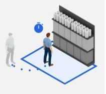
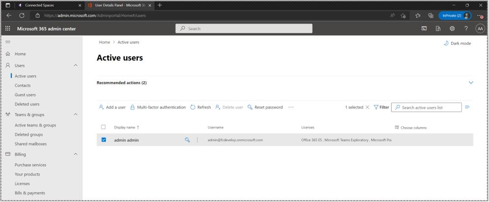
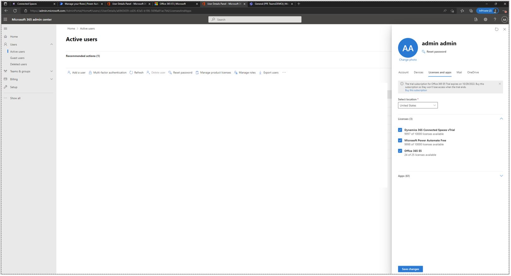
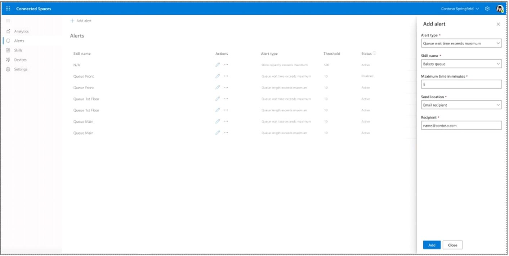
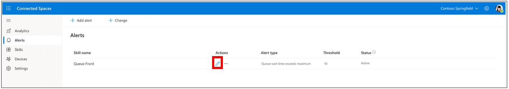

# Add alerts in the Dynamics 365 Connected Spaces Preview web app

You can add alerts in the Dynamics 365 Connected Spaces Preview web app to:

- Monitor trends and patterns across your physical space in near real time
- Improve customer engagement
- Optimize staffing
- Save time

You can create alerts for skills (pre-built AI models) after [adding those skills](web-app-cameras-add-skills.md) in the web app. Connected Spaces Preview includes alerts for two types of skills: queue and area

The following table shows which alerts are available for each skill.

|Skill|Image|Skill description|Alert type|
|-----------|--------------------------------|----------------------------------|--------------------------------|
|Queue||Monitor queue wait time and queue lengths to improve the experience and provide informed insights for employee shift management.|- Queue wait time exceeds maximum - Queue length exceeds maximum|
|Area||Create the real-world equivalent of the digital customer engagement funnel for areas and promotions. This capability allows space managers to measure the effectiveness of areas in their space.|Dwell time at display exceeds threshold|

## Prerequisites

You must have a Microsoft Office 365 (E1 or later) license to use alerts in Connected Spaces Preview. The Office 365 license includes Microsoft Outlook and Microsoft Teams. If you don't have an Office 365 license, [you can sign up for a free trial](https://www.microsoft.com/microsoft-365/enterprise/office-365-e5?activetab=pivot:overviewtab). 

After signing up for Office 365, associate the Office 365 license with Connected Spaces Preview users in the [Microsoft 365 admin center](https://admin.microsoft.com/Adminportal/Home?ref=/users) by doing the following:

1. Select a user. 

    

2. In the pane on the right side of the screen, select the **Licenses and apps** tab.

3. Make sure that all of the following licenses are selected:

    - Dynamics 365 Connected Spaces vTrial
    - Microsoft Power Automate Free
    - Office 365 E1 or later ([Compare Office 365 enterprise licenses](https://www.microsoft.com/microsoft-365/enterprise/compare-office-365-plans))

    

## Enable alerts

Connected Spaces uses Microsoft Power Automate as the alert delivery platform. As part of the initial configuration process, create an automated workflow with Power Automate by following the steps below. After creating your workflow all future alert management occurs within the Connected Spaces web application.

1. If you haven't already done so, [create skills for your space](web-app-cameras-add-skills.md). You can't add alerts if you haven't created skills. 

    > [!NOTE]
    > Camera skills must also be active. Alerts cannot be created if camera skills are inactive. 

2. In the web app, on the left side of the screen, select **Alerts**, and then select **Add alert**.

    

3. In the **Enable alerts** dialog box, select **Go to Power Automate**. 

    
    
4. Sign in with your work or organization account.

5. In the Power Automate screen, Microsoft Dataverse will automatically be connected for you. If you have Teams and Outlook licenses, those apps should also be connected for you. If you need to connect them manually, at the bottom of the screen, select the **More info** (three dots) button next to each source, and then sign into the apps to connect them. Select **Continue** when you're ready to move forward.

    
    
6. In the next Power Automate screen, select the down arrow for the **Team** field. The Team ID will automatically be filled in when you do this. You don't need to fill in any other fields in this screen. Select **Save** in the upper-right corner of the screen when you're done.

    

## Add an alert

1. In the Connected Spaces web app, on the left side of the screen, select **Alerts**, and then on the right side of the screen, select the type of alert you want to create from the **Alert type** list.

    
    
2. In the **Add alert** section:

    1. Select the skill name.
    2. Select your threshold (people or minutes).
    3. Select the send location (Teams or Outlook).
    4. Enter your recipient information (Outlook email or Teams email address). If you want to add more than one email address, separate the addresses with a semi-colon.
    5. Select **Add**.

        
        
## Edit an existing alert

1. In the web app, on the left side of the screen, select **Alerts**, and then under **Actions**, select the **Edit** (pencil) button. 

    

2. Under **Edit alert** on the right side of the screen, make your changes.

    

3. Select **Save** when you're done.

## Delete an alert

1. In the web app, on the left side of the screen, select **Alerts**, and then under **Actions**, select the **More info** (three dots) button. 

     button")
    
2. Select **Delete**. 

3. Confirm the deletion.
