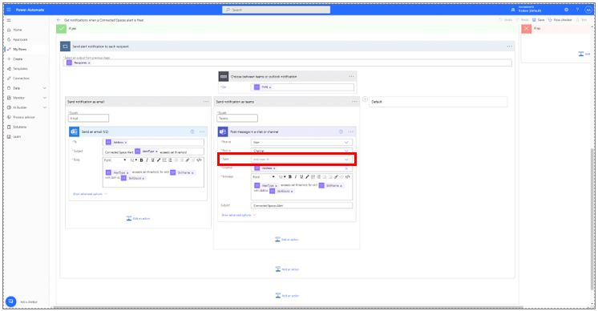

# Add alerts in the Dynamics 365 Connected Spaces Preview web app

You can add alerts in the Dynamics 365 Connected Spaces Preview web app to:

- Monitor trends and patterns across your physical space in near real time
- Improve customer engagement
- Optimize staffing
- Save time

You can create alerts for skills (pre-built AI models) after [adding those skills](cameras-add-skills.md) in the web app. Connected Spaces Preview includes three types of skills: queue management, display effectiveness, and shopper analytics.

|Queue management|Display effectiveness|Shopper analytics|
|-------------------------|-------------------------|-------------------------|
||||

The following table shows which alerts are available for each skill.

|Skill|Skill description|Alert type|
|-----------------------|---------------------------------------------|----------------------------------|
|Queue management|Monitor queue wait time and queue lengths to improve shopper experience and provide informed insights for employee shift management.|Queue wait time exceeds maximum|
|||Queue length exceeds maximum|
|Display effectiveness|Create the real-world equivalent of the digital customer engagement funnel for promotions. This capability allows merchandisers and store managers to measure the effectiveness of promotions/displays within the store, tracking shopper footfall and engagement.|Dwell time at display exceeds threshold|

## Enable alerts

Connected Spaces uses Microsoft Power Automate as the alert delivery platform, which means that you must enable alerts in  Power Automate before you can add them in Connected Spaces. You can open Power Automate directly from Connected Spaces.

> [!NOTE]
> You only need to enable alerts one time through Power Automate. After enabling alerts, all alert management happens in the Connected Spaces web app. 

1. In the web app, on the left side of the screen select **Alerts**, and then select **Add alert**.

    

2. In the **Enable alerts** dialog box, select **Go to Power Automate**. 

    
    
3. Sign in with your work or organization account.

4. In the Power Automate screen, connect your Microsoft Dataverse, Teams, and Outlook accounts, and then select **Connect**.

    
    
5. In the next Power Automate screen, enter the desired values for the email and Teams fields, and then select **Save** in the upper-right corner of the screen.

    

## Add an alert

1. In the Connected Spaces web app, on the left side of the screen, select **Alerts**, and then on the right side of the screen, select the type of alert you want to create from the **Alert type** list.

    
    
2. In the **Add alert** section:

    1. Select the skill name.
    2. Select your threshold (people or minutes).
    3. Select the send location (Teams or Outlook).
    4. Enter your recipient information (Outlook email or Teams email address).
    5. Select **Add**.

        
        
## Edit an existing alert

1. In the web app, on the left side of the screen, select **Alerts**, and then under **Actions**, select the **Edit** (pencil) button. 

    

2. Under **Edit alert** on the right side of the screen, make your changes.

    

3. Select **Save** when you're done.

## Delete an alert

1. In the web app, on the left side of the screen, select **Alerts**, and then under **Actions**, select the **More info** (three dots) button. 

     button")
    
2. Select **Delete**. 

3. Confirm the deletion.
