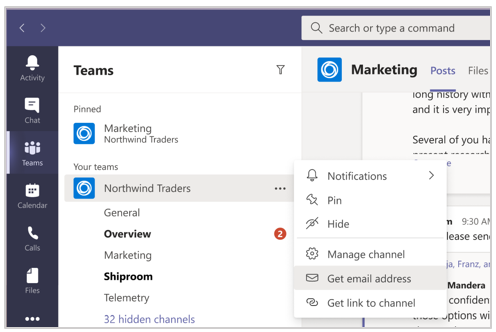
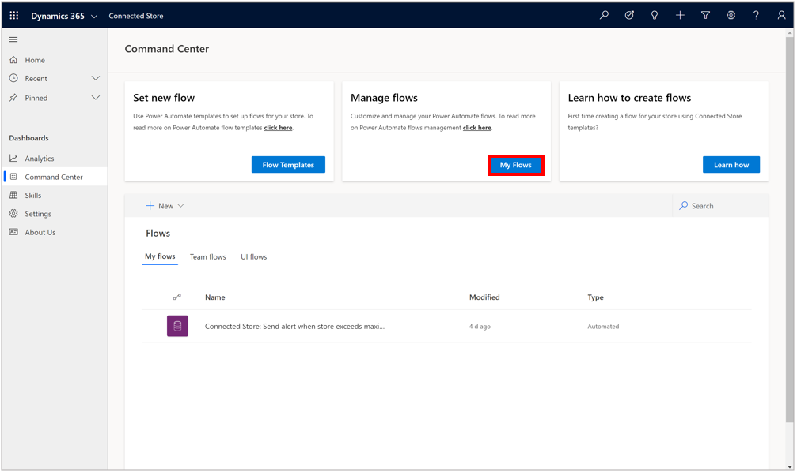
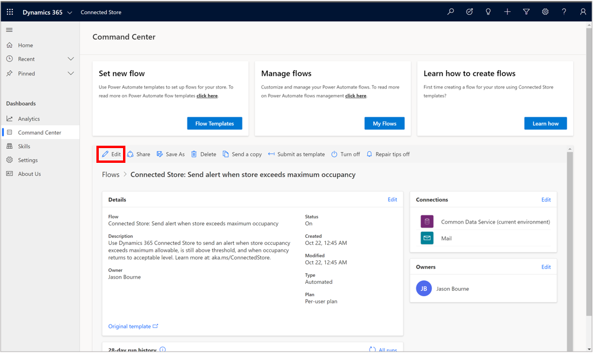
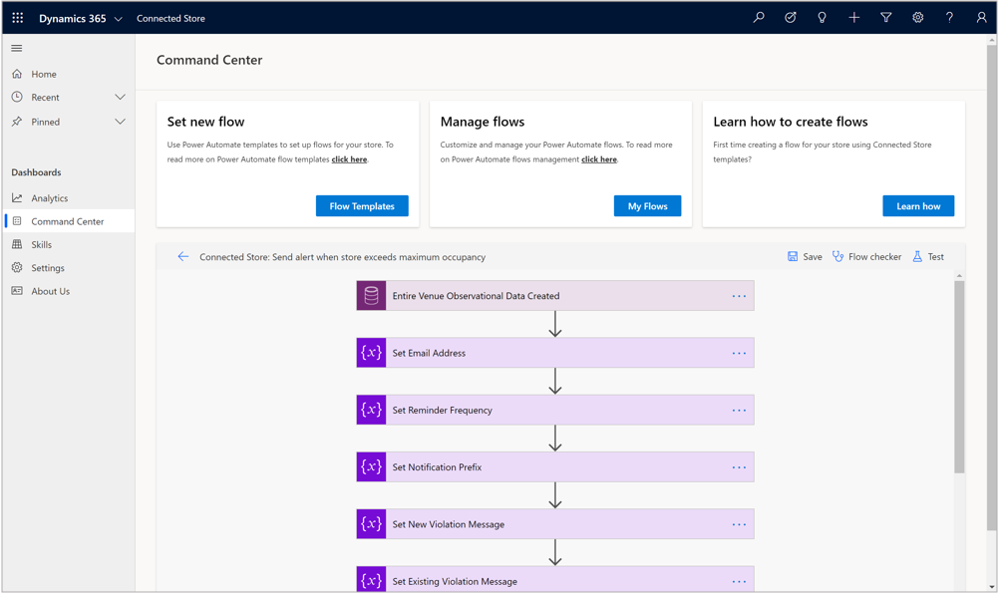
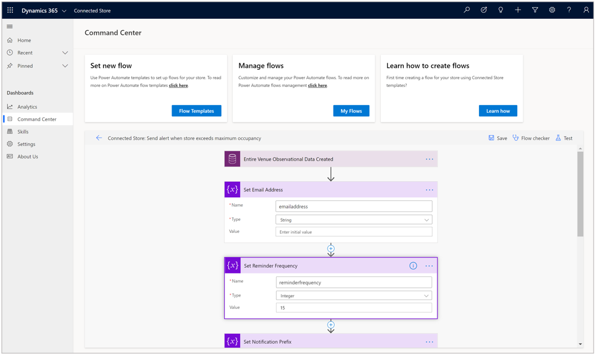

# Use the Command Center in the Dynamics 365 Connected Store Preview web app to set up a maximum store occupancy notification 

You can set the maximum occupancy threshold for a store in the Microsoft Dynamics 365 Connected Store Preview mobile app. When you set the **Maximum Occupancy** value, 
you'll see the following items on the [**Shopper Analytics Summary** page](shopper-analytics-summary-page.md):

- **Over capacity** card

- **Over capacity instances** graph

- **Footfall power hours** heatmap

You can use the Command Center if you also want to send an email notification when maximum occupancy thresholds are exceeded. You do this by customizing a 
Power Automate flow template. After customizing the template, the designated user(s) will receive reminders at the frequency you set while the store occupancy 
remains above the maximum occupancy threshold.

> [!IMPORTANT]
> You must allow pop-ups (pop-up blockers must be disabled) in your browser to receive the email notifications.

## Customize a Power Automate flow to send email notifications when the maximum occupancy threshold is exceeded

1. In the Command Center, under **Set new flow**, select **Flow Templates**.

    
    
2. If this is the first flow that you've created, you'll see the **Welcome to Power Automate** dialog box. Select the appropriate country in the list, and then select **Get started**.
    
3. In the pop-up dialog box, enter your credentials so you can access Power Automate.
    
4. Look for the Connected Store widget that looks like this. 

    

    If you don't see the widget on your screen, select **See more templates**.

    
    
    If there are issues loading the template in the web page, and pop-up blockers for your web browser are already disabled, select the **Trouble loading** link to go to the external Power Automate website. You may also have to enter your credentials again.
    
    
    
    At this point, you'll see the Connected Store widget in the Power Automate website page.
    
    
    
5. Select the Connected Store widget to load the template, and then select **Continue**.

    

7. At this point, you'll see all the components included in the **Send alert** flow. There are many components, but you only need to set the following two items:

    - In the **Set Email Address** section, in the **Value** field, enter an email address. **Do not edit the Name and Type fields in this section.** If you want the email to be sent to more than one recipient, separate each email address with a semi-colon. 

    

    > [!TIP]
    > You can also choose to have alerts sent to a specific Microsoft Teams channel. To do this, locate the desired channel in Teams, select the **More options** (...) button to the right of the channel name, select **Get email address**, copy the email address, and then paste it into the **Value** field. 
    >
    > 
    
    - In the **Set Reminder Frequency** section, in the **Value** field, enter how often you want to send the email notification. For example, enter **15** if you want to send an email notification every 15 minutes while the maximum occupancy threshold is exceeded. **Do not edit the Name and Type fields in this section.**

    
    
8. Select **Save** in the upper-right corner of the page.

    
    
That's all you need to do to set up alerts for maximum occupancy. 

## Edit an existing Power Automate flow

1. In the Command Center, under **Manage flows**, select **My flows**.

    
    
2. Select the flow you want to edit, and then select **Edit**.

    
    
    The flow appears in a collapsed format.
    
    
    
3. Select the module you want to edit to expand it, and then make your edits.

    
    
4. Select **Save** in the upper-right corner when you're done.
    

    
## Next step

[Learn about the Shopper Analytics Summary page](shopper-analytics-summary-page.md)
    
    

