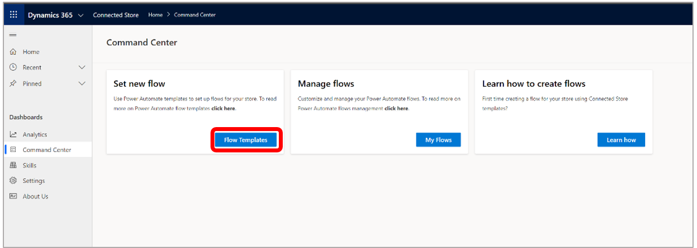
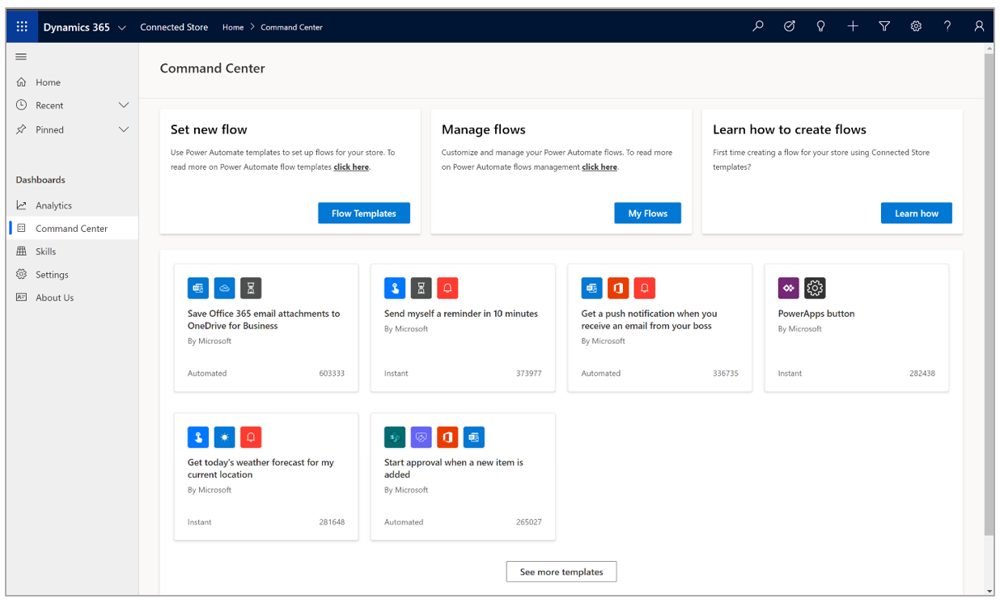
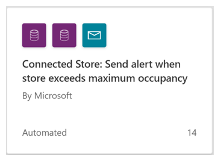
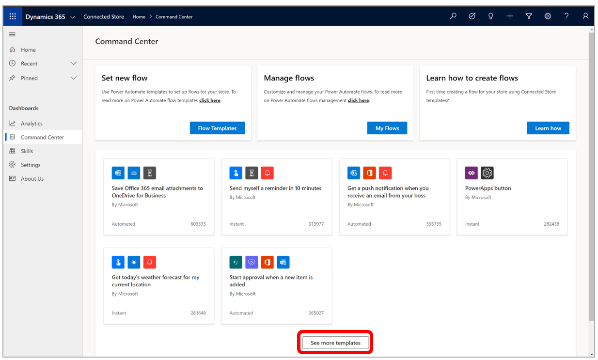
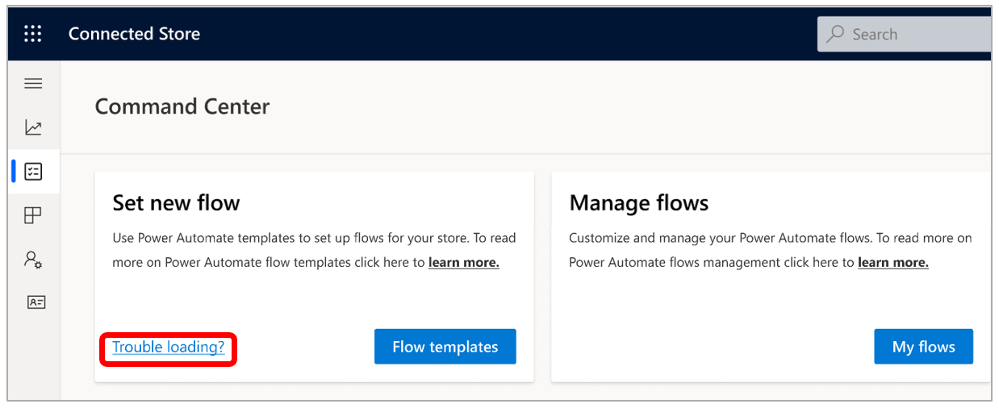
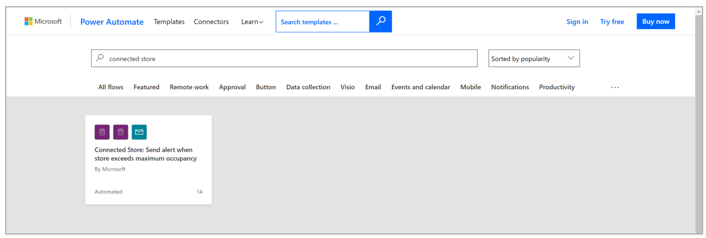
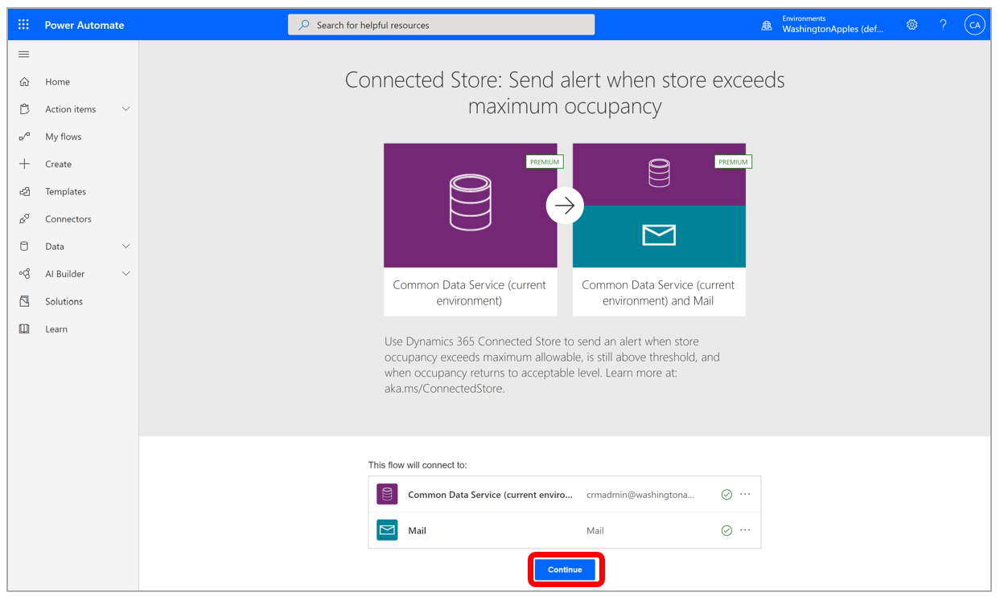
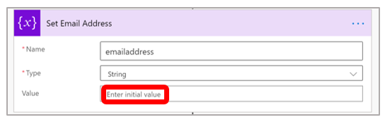
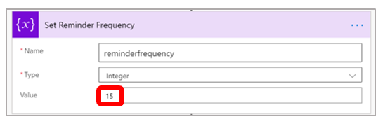
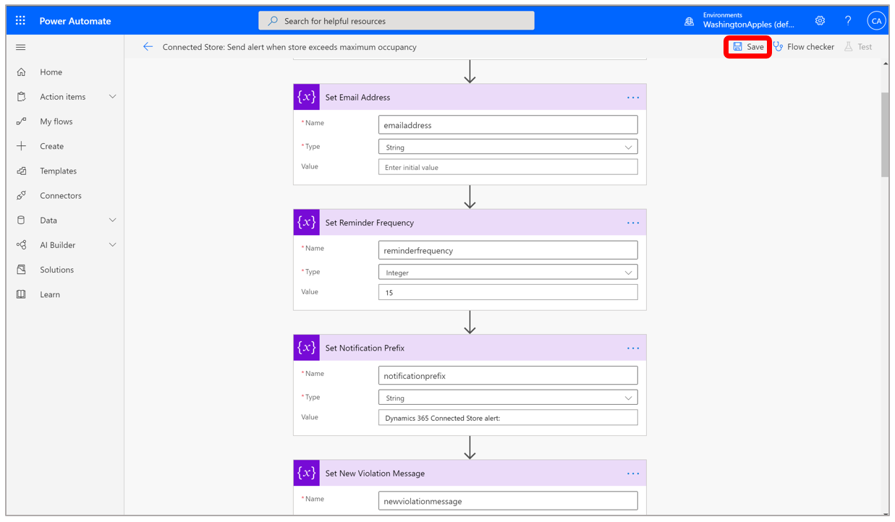

# Use the Command Center in the Dynamics 365 Connected Store web app to set up a maximum store occupancy notification 

You can set the maximum occupancy threshold for a store in the Microsoft Dynamics 365 Connected Store mobile app. When you set the **Maximum occupancy** value, 
you'll see the following items on the [**Shopper Analytics Summary** page](shopper-analytics-summary-page.md):

- **Over capacity** card

- **Over capacity instances** graph

- **Footfall power hours** heatmap

You can use the Command Center if you also want to send an email notification when maximum occupancy thresholds are exceeded. You do this by customizing a 
Power Automate flow template. After setting up the template, the designated user(s) will receive reminders at the frequency you set while the store occupancy 
remains above the maximum occupancy threshold.

> [!IMPORTANT]
> You must allow pop-ups in your browser to receive the email notifications (pop-up blockers must be disabled).

## Customize a Power Automate flow to send email notifications when the maximum occupancy threshold is exceeded

1. In the Command Center, under **Set new flow**, select **Flow Templates**.

    
    
2. In the pop-up dialog box, enter your credentials so you can access Power Automate.

    After entering your credentials, you'll see the Power Automate flow widgets.
   
    
    
3. Look for the Connected Store widget. 

    

    If you don't see it on your screen, select **See more templates**.

    
    
    If there are issues loading the template in the web page, and pop-up blockers for your web browser are already disabled, select the **Trouble loading** link to go to the external Power Automate website. You may also have to enter your credentials again.
    
    
    
    At this point, you'll see the Connected Store widget in the Power Automate website page.
    
    
    
4. Select the Connected Store widget to load the template.

5. Select **Continue**.

    

6. There are many components to the **Send alert** flow, but you only need to set the following two items:

    - In the **Set Email Address** section, in the **Value** field, enter an email address. If you want the email to be sent to more than one recipient, separate each email address with a semi-colon. 

    

    > [!IMPORTANT]
    > Do not edit the **Name** and **Type** fields in this section.
    
    - In the **Set Reminder Frequency** section, in the **Value** field, enter how often you want to send email. For example, enter **15** if you want to send an email notification every 15 minutes while the maximum occupancy threshold is exceeded.

    
    
    > [!IMPORTANT]
    > Do not edit the **Name** and **Type** fields in this section.
    
8. Select ** Save** in the upper-right corner of the page.

    
    
## See also

[Create a store with the mobile app](mobile-app-create-store.md) 
[Shopper Analytics Summary page](shopper-analytics-summary-page.md)
    
    

