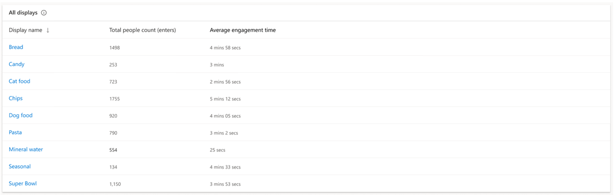
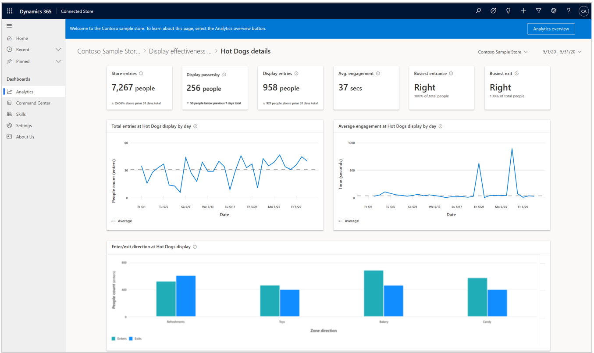
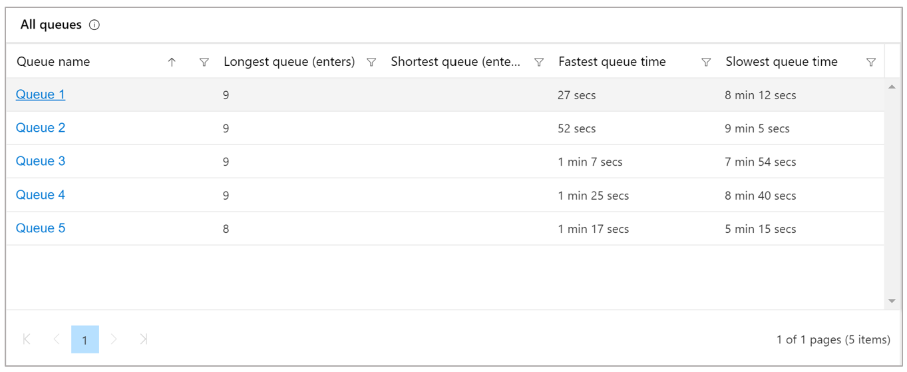
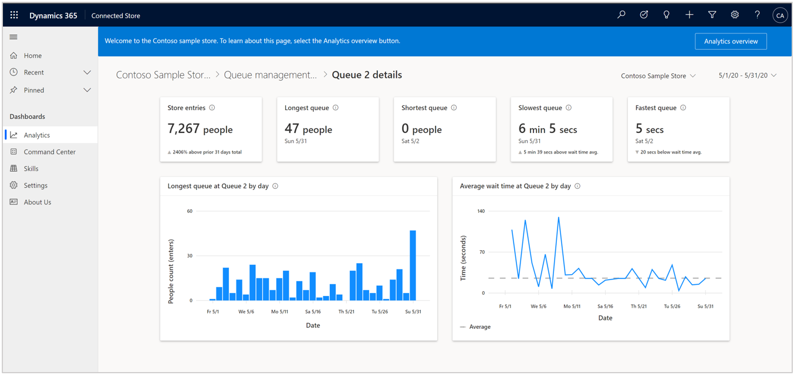
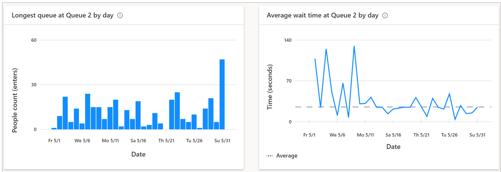

# View the details pages on the Analytics page in Dynamics 365 Connected Store

You can [use the **Analytics** page](web-app-get-insights.md) in the Microsoft Dynamics 365 Connected Store web app to get insights on your retail store. This article describes how to view details pages (available from the **Analytics** page) for the Display effectiveness and Queue management skills.

## View the Display effectiveness details page

To see details for a specific display effectiveness zone, select the desired display name at the bottom of the [Display effectiveness summary page](web-app-insights-summary-pages.md).

On this page, you can use the cards and graphs to understand:

- Of total store visitors (assuming the store has been configured to capture footfall at store entry), *how many people passed by the 
display?*

- Of display passersby, *how many people visited the display?*

- Of total display visitors, *how long, on average, did they dwell?*

- *From what direction (side of display zone) did visitors enter/exit the display zone?*

### Hightlights banner

The highlights banner at the top of the page provides a loose indication of a customer acquisition funnel. The **Store footfall** card is carried over from the [**Analytics** page](web-app-get-insights.md). 

**Display passersby.** This card highlights the number of people that passed within the camera field of view that contains the 
display effectiveness zone of interest. This gives you an indication of how much traffic passed by the display. 

The subscript in the card describes the absolute change in this value for the current time frame compared to the previous time frame of equal duration. The triangle to the left of the subscript indicates whether the change was positive or negative. 

**Display footfall.** This card highlights the number of people who entered the display effectiveness zone. 

The subscript in the card describes the absolute change in this value for the current time frame compared to the previous time frame of equal duration. The triangle to the left of the subscript indicates whether this change was positive or negative. 

**Avg. engagement.** This card highlights average time people engaged (dwelled) in the selected display effectiveness zone. 

The subscript in the card describes the absolute change in this value for the current time frame compared to average engagement (dwell) time across all displays during the selected time frame. The upward-facing triangle to the left of the subscript indicates the positive direction. 

**Busiest entrance.** This card highlights the side of the display effectiveness zone through which most people entered, 
using the friendly name assigned to the side. 

The subscript in the card details how much of the total display footfall came through the illustrated side.

**Busiest exit.** This card highlights the side of the display effectiveness zone through which most people exited, using the 
friendly name assigned to the side. 

The subscript in the card details how much of total display footfall came through that side.

### Graphs

There are three graphs at the bottom of the details page: **[Display 1] display footfall**, **[Display 1] display dwell time**, and **[Display 1] Enter/Exits sum**.

**[Display 1] display footfall.** This graph shows footfall into Display 1 for the selected time frame, compared to the average 
footfall, represented by the dashed line for Display 1 during the selected time frame.

**[Display 1] display dwell time.** This graph shows the average time spent dwelling in the Display 1 zone for selected time frame, 
compared to the average engagement (dwell) time represented by the dashed line for Display 1 during the selected time frame.

**[Display 1] Enter/Exits sum.** This graph shows the break-down of footfall type by zone side, including how much traffic is 
coming/going from a specific direction into/out of the zone. Side names correspond to the friendly names created during skills/zone 
configuration. 

> [!TIP]
> You can hover over the information icon for any graph to get more information about the graph. You can also hover over a point 
in a graph to reveal details.

## View the Queue management details page

To see the details for a specific queue, select the desired queue in the **All queues** table at the bottom of the [Queue management summary page](web-app-insights-summary-pages.md).

The **All queues** table contains a sortable list of all queue management zones by name, longest and shortest queue value, and fastest and slowest queue time for the selected time range. Sort the list by selecting a single column heading. You can also filter each metric for a specific value by using the Filter button next to each column heading.

To see details for a specific queue management zone, select the desired queue name at the bottom of the page.

On the **Queue Management details** page, you can use the cards and graphs to understand the rhythm and flow of a specific queue management zone.

### Highlights banner

The banner at the top of the page highlights the key takeaways and comparisons for the specific queue. The **Store footfall** card is carried over from the [**Analytics page**](web-app-get-insights.md). 

**Longest queue.** This card highlights the value for the greatest number of people who occupied the specific Queue management zone along with the date when it occurred, for the selected time frame.

**Shortest queue.** This card highlights the value for the least number of people who occupied the specific Queue management zone along with the date when it occurred, for the selected time frame.

**Slowest queue.** This card highlights the maximum wait (dwell) time for the specific Queue management zone during the selected time frame, along with the date on which the value was observed. 

The subscript describes the absolute change in this value for the current time frame compared to average wait (dwell) time for the specific Queue management zone during the selected time frame. The triangle to the left of the subscript indicates whether the change was positive or negative.

**Fastest queue.** This card highlights the shortest average wait time for people for the specific Queue management zone, along with the date on which the value was observed.

### Graphs

The **Longest queue at [Queue 1]** and **Average wait time at [Queue 1]** graphs appear at the bottom of the page.

**Longest queue at [Queue 1].** This graph shows the people count trend data for the specific Queue management zone that received the greatest footfall for each timepoint (hour, day) during the selected time frame.

**Average wait time at [Queue 1].** This graph shows the average wait (dwell) time trend data for the specific Queue management zone during the selected time frame.

To see data values for timepoint, hover over the graph. 

 

