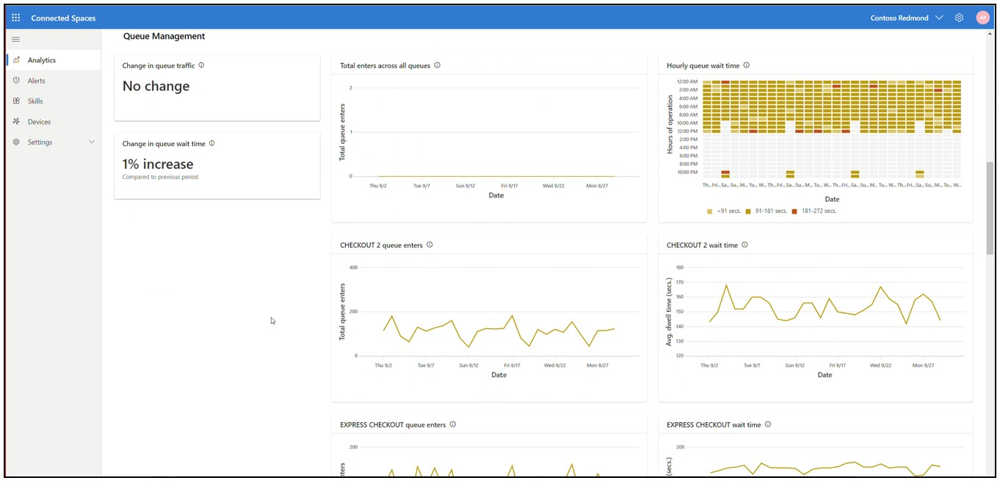

# Use the Analytics page in Dynamics 365 Connected Spaces Preview to get insights on your store

[!INCLUDE[banner](includes/banner.md)]

Microsoft Dynamics 365 Connected Spaces Preview serves as a platform to view, explore, and act on the diversity of data captured in your store. This article describes how to get insights from your store using the **Analytics** page. 

Connected Spaces supports the following camera skills: 

- Shopper analytics

- Display effectiveness

- Queue management
 
For a quick overview of how to get insights, scan the screens in this and other articles. 

> [!IMPORTANT]
> To use Connected Spaces, you must use a supported browser and the browser must have the most up-to-date version installed. Connected Spaces supports Chromium-based browsers (Chrome, Opera, and Edge), Firefox, and Safari. Internet Explorer is not supported. 

## Analytics page overview

The **Analytics** page, which is organized by skill (Shopper analytics, Queue management, and Display effectiveness), provides a sense of the store’s overall performance for configured skills. Each skill type has small cards on the left that highlight key takeaways for the configured skill and charts on the right for each skill instance. 

## Filter by date

By default, the **Analytics** page shows the last 7 days, but you can select a custom date range or choose from other pre-selected ranges by using the **Date** filter. 

## Filter by skill type

By default, the skill type filter shows all skill types, but you can select a skill type (Shopper analytics, Queue management, or Display effectiveness) in the **Skill** filter.

## Highlights cards

Each skill type includes highlight cards with information buttons that you can hover over to get additional details.

**Store entries.** This card highlights the sum of people that entered the store for the selected time frame. 

The subscript in the card describes the percent change in this value for the current time frame compared to the previous time frame of equal duration. The triangle to the left of the subscript indicates whether the change was positive or negative. 

>[!NOTE]
> If there’s insufficient data to draw a comparison, no information is displayed in the subscript area. This is true for all cards on the **Analytics** and other pages.

**Busiest day.** This card highlights the day and date within the selected time frame that had the greatest number of people, along with the people count. 

The subscript in this card describes the absolute change in this value for the current time frame compared to average entries across all displays during the selected time frame. The triangle to the left of the subscript indicates how much greater entries for the highlighted day were compared to the daily average entries during the selected time frame. 

**Largest increase in display traffic.** This card highlights the display with the largest increase in display traffic as compared to all other displays over the previous time period.  

**Largest decrease in display traffic.** This card highlights the display with the largest decrease in display traffic as compared to all other displays over the previous time period.   

**Largest increase in visit time.** This card highlights the display with the largest increase in visit time as compared to all other displays over the previous time period.  

**Largest decrease in visit time.** This card highlights the display with the largest decrease in visit time as compared to all other displays over the previous time period.  

**Longest queue.** This card highlights the queue that was occupied by the most number of people across all queues for the selected time frame, along with the name of the queue and the date on which the value was observed. 

**Slowest queue.** This card highlights the maximum wait (dwell) time for a queue across all queues for a selected time frame, along with the name of the queue and the date on which the value was observed. 

The subscript in this card describes the absolute change in this value for the current time frame compared to average wait (dwell) time across all queues during the selected time frame. The triangle to the left of the subscript indicates whether the change was positive or negative.

## Graphs on the Analytics page

To the right of the highlight cards are graphs for each skill, starting with Shopper analytics.

### Shopper Analytics graphs

> [!TIP]
> You can hover over the information button for any graph to get more information about the graph. You can also hover over a point in a graph to reveal details.

**Total entries across store by [time slice (day, hour)].** This graph shows the total number of people that entered the store, across all Shopper analytics zones. The dotted line is the average number of entries for the store during the selected time frame. 

**Peak footfall by [time slice (day, hour)].**  This graph shows the maximum number of people that were in the store on an hourly basis, taking into account the flow of people into AND out of the store, for the selected time frame.

### Display Effectiveness graphs

**Entries**. This chart shows the number of people entering the skill zone over the time period selected.

**Visit time**. This chart shows the average dwell time of the people who entered the skill zone over the time period selected.

### Queue Management graphs

**Longest queue across store by [time slice (day, hour)].** This graph shows the people count of the queue that had the most people for the selected time frame. 

> [!NOTE]
> The solution can only capture people within the camera’s field of view. This value could be underestimated if the queue length extends beyond the field of view.

**Average wait time across all queues by [time slice (day, hour)].** This graph shows the average time people spend, in seconds, in a queue across the store for the selected time frame. The dotted line is the average wait time for all Queue management zones during the selected time frame.

