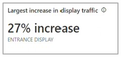

# Use the Analytics page in Dynamics 365 Connected Spaces Preview to get insights on your store

[!INCLUDE[banner](includes/banner.md)]

Microsoft Dynamics 365 Connected Spaces Preview serves as a platform to view, explore, and act on the diversity of data captured in your store. This article describes how to get insights from your store using the **Analytics** page. 

Connected Spaces supports the following camera skills: 

- Shopper analytics

- Display effectiveness

- Queue management
 
For a quick overview of how to get insights, scan the screens in this and other articles. 

> [!IMPORTANT]
> To use Connected Spaces, you must use a supported browser and the browser must have the most up-to-date version installed. Connected Spaces supports Chromium-based browsers (Chrome, Opera, and Edge), Firefox, and Safari. Internet Explorer is not supported. 

## Analytics page overview

The **Analytics** page, which is organized by skill (Shopper analytics, Queue management, and Display effectiveness), provides a sense of the store’s overall performance for configured skills. Each skill type has small cards on the left that highlight key takeaways for the configured skill and graphs on the right for each skill instance. 

## Filter by date

By default, the **Analytics** page shows the last 7 days, but you can select a custom date range or choose from other pre-selected ranges by using the **Date** filter. 

## Filter by skill type

By default, the skill type filter shows all skill types, but you can select a skill type (Shopper analytics, Queue management, or Display effectiveness) in the **Skill** filter.

## Highlights cards

Each skill type includes highlight cards with information buttons that you can hover over to get additional details.

**Change in store entries.** This card highlights the sum of people that entered the store for the selected time frame. 

>[!NOTE]
> If there’s insufficient data, no information is displayed in the card. This is true for all cards on the **Analytics** and other pages.

**Busiest day.** This card highlights the day of the week and date within the selected time frame that had the greatest number of people, along with the people count. 

**Largest increase in display traffic.** This card highlights the display with the largest increase in display traffic as compared to all other displays over the previous time period.  

**Largest decrease in display traffic.** This card highlights the display with the largest decrease in display traffic as compared to all other displays over the previous time period.   

**Largest increase in visit time.** This card highlights the display with the largest increase in visit time as compared to all other displays over the previous time period.  

**Largest decrease in visit time.** This card highlights the display with the largest decrease in visit time as compared to all other displays over the previous time period.  

**Change in queue traffic.** This card shows the percentage increase or decrease for queue traffic as compared to the previous time period.

**Change in queue wait time.** This card shows the percentage increase or decrease for the queue wait time as compared to the previous time period. 

## Graphs on the Analytics page

To the right of the highlight cards are graphs for each skill, starting with Shopper analytics.

### Shopper Analytics graphs

> [!TIP]
> You can hover over the information button for any graph to get more information about the graph. You can also hover over a point in a graph to reveal details.

**Total entries across store by [time slice (day, hour)].** This graph shows the total number of people that entered the store, across all Shopper analytics zones. 

**Peak footfall entires power hour by [time slice (day, hour)].**  This graph shows the hourly breakdown of store entries per day.

**Footfall at each queue by [time slice (day, hour)].** This graph shows the total number of people that entered the store, across each Shopper analytics skill, individually. 

### Display Effectiveness graphs

**Entries by [time slice (day, hour)].** This graph shows the number of people entering the skill zone over the time period selected.

**Visit time by [time slice (day, hour)].** This graph shows the average dwell time of the people who entered the skill zone over the time period selected.

### Queue Management graphs

**Total enters across all queues by [time slice (day, hour)].** The total number of people who entered all queues, by day.

**Hourly queues wait time by [time slice (day, hour)].** The hourly breakdown of average queue wait times, by day for all queues.

**Queue enters by individual queues time by [time slice (day, hour)].** The total number of queue entries for each specific queue.

