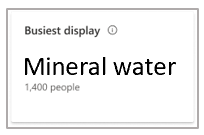
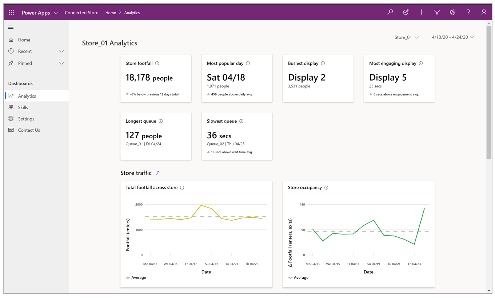
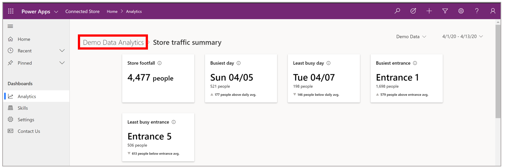
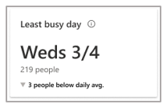
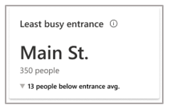
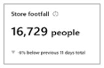
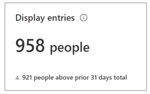
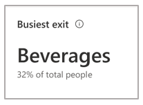
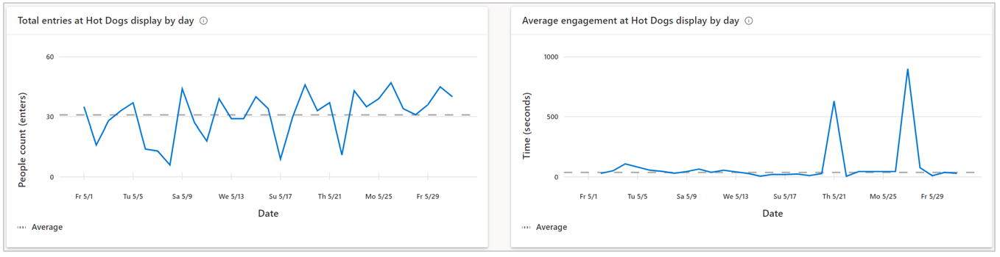

# Use the Dynamics 365 Connected Store web app to get insights on your store

Dynamics 365 Connected Store serves as a platform to view, explore, and act on the diversity of data captured in your retail store. This article describes how to get insights from your store using the web app. 

Connected Store supports the following camera skills: 

- Shopper analytics

- Display effectiveness

- Queue management [Coming soon]. 
 
For a quick overview of how to get insights using the web app, scan the screens in this article. For a more thorough understanding, read through each section and experiment!

## Analytics page

After entering your credentials, you’ll see the **Analytics** page. This page provides a sense of the store’s overall performance across the skill-configured zones. 

The page includes a banner at the top that highlights key takeaways from all skill-configured zones. Below the banner, the page displays two visualizations per skill that illustrate general trends for those skills.

By default, the **Analytics** page shows the last 30 days, but you can select a custom date range or choose from other pre-selected ranges by using the date picker in the upper-right corner of the page. 

### Highlights banner

The highlights banner shows the general rhythm of the store. The banner includes two cards for each configured skill. 

1.	Shopper analytics

2.	Display effectiveness

3.	Queue management

Each card in the banner has an information icon that you can hover over to get additional details.

**Store footfall.** This card highlights the sum of people that entered the store for the selected time frame. 

The subscript describes the percent change in this value for the current time frame compared to the previous time frame of equal duration. The triangle to the left of the subscript indicates whether the change was positive or negative. 

>[!NOTE]
> If there’s insufficient data to draw a comparison, no information is displayed in the subscript area. This is true for all cards in the highlights banner.

**Busiest day.** This card highlights the day and date within the selected time frame that had the greatest number of people, along with the people count. 

The subscript describes the absolute change in this value for the current time frame compared to average footfall across all displays during the selected time frame. The triangle to the left of the subscript indicates how much greater footfall for the highlighted day was compared to the daily average footfall during the selected time frame. 

**Busiest display.** This card highlights the name of the display that had the greatest number of people during the selected timeframe, along with the people count. 

> [!NOTE]
> Because there are several factors that can contribute to a change in value (for example, the number of displays in the store or a change in display configuration), the application does not include a comparison subscript.

**Most engaging display.** This card highlights the name of the display where people dwelled longer on average, along with the corresponding value. 

The subscript describes the absolute change in this value for the current time frame compared to average dwell time for all displays during the selected time frame. The triangle to the left of the subscript indicates whether this change was positive or negative. 

**Longest queue.** This card highlights the queue that was occupied by the most number of people across all queues for the selected time frame, along with the name of the queue and the date on which the value was observed. 

**Slowest queue.** This card highlights the maximum wait (dwell) time for a queue across all queues for a selected time frame, along with the name of the queue and the date on which the value was observed. 

The subscript describes the absolute change in this value for the current time frame compared to average wait (dwell) time across all queues during the selected time frame. The triangle to the left of the subscript indicates whether the change was positive or negative.

Below the highlights banner, the Analytics page shows two data visualizations for each skill, starting with Shopper analytics.

> [!TIP]
> You can hover over the information icon for any graph to get more information about the graph. You can also hover over a point in a graph to reveal details.

### Shopper analytics visualizations

**Total footfall across store.** This graph shows the total number of people that have entered the store, across all Shopper analytics zones. The dotted line is the average footfall for the store during the selected time frame. 

**Total occupancy across store.**  This graph shows how many people were in the store (store density), on an hourly average basis, taking into account the flow of people into AND out of the store, for the selected time frame.

### Display effectiveness visualizations

**Total footfall across displays.** This graph shows the total number of people that entered the display effectiveness zones across the entire store. The dotted line is the average footfall across display effectiveness zones during the selected time frame.

**Average engagement across displays.** This graph shows the average time, in seconds, that people engaged (dwelled) within display effectiveness zones across the entire store. The dotted line is the average engagement (dwell) time for all display effectiveness zones during the selected time frame.

### Queue management visualizations

**Longest queue in store.** This graph shows the people count of the queue that had the most people for the selected time frame. 
Note: The solution can only capture people within the camera’s field of view. This value could be underestimated if the queue length extends beyond the field of view.

> [!NOTE]
> The solution can only capture people within the camera’s field of view. This value could be underestimated if the queue length extends beyond the field of view.

**Average wait time across all queues.** This graph shows the average time people spend, in seconds, in a queue across the store for the selected time frame The dotted line is the average wait time for all queue management zones during the selected time frame.

### View summary pages

To view the summary page with additional visualizations for any skill, select the blue arrow to the right of the skill. 

To go back to the **Analytics** page from any summary page, select from the breadcrumb at the top of the page.

### Shopper analytics summary page

The **Shopper analytics summary** page includes insights related to footfall trends, patterns, changes, and anomalies at store entries/exits. This page shows a view of the performance of all Shopper analytics zones. You can explore how many people visited the store during a given timeframe, broken down by entrance.

The banner at the top of the page highlights the key takeaways and comparisons. The first two cards, **Store footfall** and **Busiest day**, are carried over from the **Analytics Overview** page. For information on these cards, see the **Analytics** section in this article.

**Least busy day**. This card highlights the day and date within the selected time frame that had the least number of people, along with the people count. 

The subscript describes the absolute change in this value for the current time frame compared to average footfall across all displays during the selected time frame. The triangle to the left of the subscript indicates the difference in footfall for the highlighted day, compared to the daily average footfall during the selected time frame. 

**Busiest entrance.** This card highlights the name and corresponding value of the Shopper analytics zone that received the greatest footfall for the selected time frame. 

The subscript describes the absolute change in this value for the current time frame compared to the previous time frame of equal duration. The triangle to the left of the subscript indicates whether this change was positive or negative. 

**Least busy entrance.** This card highlights the name and corresponding value of the Shopper analytics zone that received the least footfall for the selected time frame. 

The subscript describes the absolute change in this value for the current time frame compared to the previous time frame of equal duration. The triangle to the left of the subscript indicates whether this change was positive or negative. 

**Total footfall at all entrances.** This graph breaks down total store footfall according to Shopper analytics zone. 

You can view trends for individual zones in the line graphs below (for example, **Footfall at Entrance 1**).

To see data for each individual entrance, hover over the desired data in the graph.

### Display effectiveness summary page

The **Display effectiveness summary** page shows a view of the performance of all display effectiveness zones and their performance relative to each other. Use this page to answer this question: “How effective are my displays?”

The banner at the top of the page highlights the key takeaways and comparisons. The **Store footfall**, **Busiest display**, and **Most engaging** cards are carried over from the **Analytics Overview** page. See the **Analytics Overview** page section of this article to learn about those cards.
 
**Least busy display.** This card highlights the name of the display that had the least number of people for the selected time frame, along with the people count. 

> [!NOTE]
> Because there are several factors that can contribute to a change in value (for example, number of displays in the store or a change in display configuration), the app does include a comparison subscript.

**Least engaging display.** This card highlights the name of the display where people engaged (dwelled)  shorter on average than other displays, along with the time, in seconds, for dwell time. 

The subscript describes the absolute change in this value for the current time frame compared to average engagement (dwell time) across all displays during the selected time frame. The downward triangle to the left of the subscript indicates that the change was negative. 

**3 busiest displays.** This graph shows the people count trend data for the three display effectiveness zones that, on average, received the greatest footfall during the selected time frame. These trend lines are placed in context with the average footfall across all display effectiveness zones, illustrated by the dotted line.

**3 most engaging displays.** This graph depicts the dwell time trend data for the three display effectiveness zones in which people, on average, spent the most time during the selected time frame. These trend lines are placed in context with the average engagement (dwell) time across all display effectiveness zones, illustrated by the dotted line.

**All store displays.** This table contains a sortable list of all display effectiveness zones by name, total people count, and average engagement time. Sort the list by selecting a single column heading. You can also filter each metric for a specific value by using the **Filter** button next to each column heading.

To see data values for each display, hover over the graph. 

To see details for a specific display effectiveness zone, select the desired display name at the bottom of the page.

### Display effectiveness details page

On this page, you can use the cards and graphs to understand:

- Of total store visitors (assuming the store has been configured to capture footfall at store entry), *how many people passed by the display?*

- Of display passersby, *how many people visited the display?*

- Of total display visitors, *how long, on average, did they dwell?*

- *From what direction (side of display zone) did visitors enter/exit the display zone?*

The banner at the top of the page provides a loose indication of a customer acquisition funnel.

**Store footfall.** This card highlights the sum of people that entered the store for the selected time frame. 

The subscript describes the percent change in this value for the current time frame compared to the previous time frame of equal duration. The triangle to the left of the subscript indicates whether this change was positive or negative. 

**Display passerby.** This card highlights the number of people that passed within the camera field of view that contains the display effectiveness zone of interest. 

This gives you an indication of how much traffic passed by the display. The subscript describes the absolute change in this value for the current time frame compared to the previous time frame of equal duration. The triangle to the left of the subscript indicates whether the change was positive or negative. 

**Display footfall.** This card highlights the number of people who entered the display effectiveness zone. 

The subscript describes the absolute change in this value for the current time frame compared to the previous time frame of equal duration. The triangle to the left of the subscript indicates whether this change was positive or negative. 

**Avg. engagement.** This card highlights average time people engaged (dwelled) in the selected display effectiveness zone. 

The subscript describes the absolute change in this value for the current time frame compared to average engagement (dwell) time across all displays during the selected time frame. The upward-facing triangle to the left of the subscript indicates the positive direction. 

**Busiest entrance.** This card highlights the side of the display effectiveness zone through which most people entered, using the friendly name assigned to the side. 

The subscript details how much of the total display footfall came through the illustrated side.

**Busiest exit.** This card highlights the side of the display effectiveness zone through which most people exited, using the friendly name assigned to the side. 

The subscript details how much of total display footfall came through that side.

**[Display 1] display footfall.** This graph shows footfall into Display 1 for the selected time frame, compared to the average footfall, represented by the dashed line for Display 1 during the selected time frame.

**[Display 1] display dwell time.** This graph shows the average time spent dwelling in the Display 1 zone for selected time frame, compared to the average engagement  (dwell) time represented by the dashed line for Display 1 during the selected time frame.

**[Display 1] Enter/Exits sum.** This graph shows the break-down of footfall type by zone side, including how much traffic is coming/going from a specific direction into/out of the zone. Side names correspond to the friendly names created during skills/zone configuration. 

> [!TIP]
> You can hover over the information icon for any graph to get more information about the graph. You can also hover over a point in a graph to reveal details.

