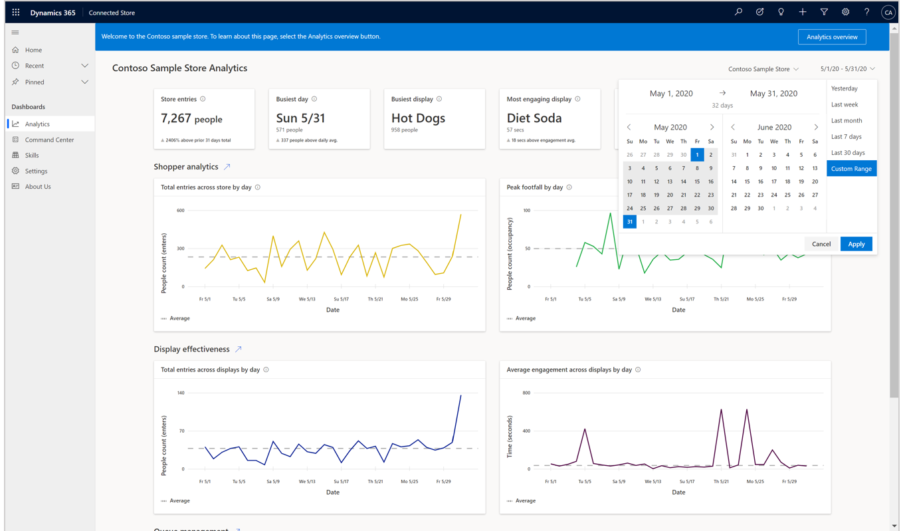
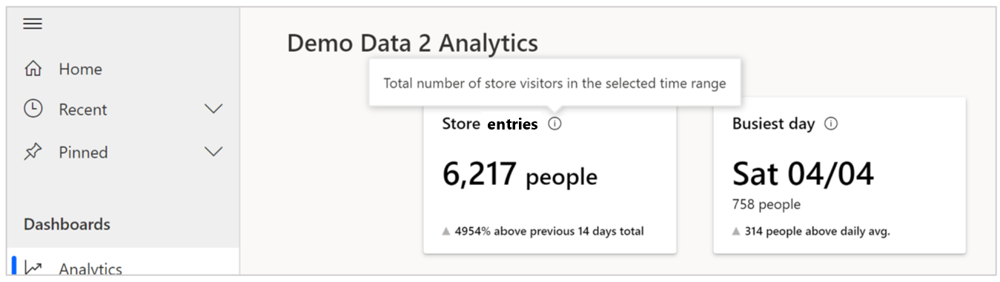
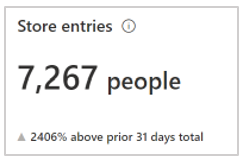
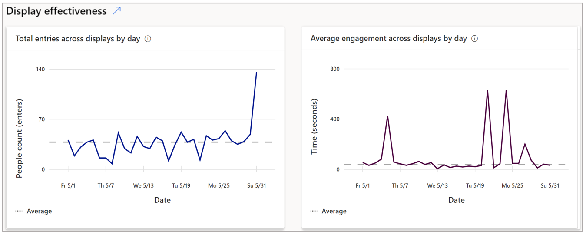

# Use the Dynamics 365 Connected Store web app to get insights on your store

Dynamics 365 Connected Store serves as a platform to view, explore, and act on the diversity of data captured in your retail store. This article describes how to get insights from your store using the **Analytics** page in the web app. 

Connected Store supports the following camera skills: 

- Shopper analytics

- Display effectiveness

- Queue management [Coming soon]. 
 
For a quick overview of how to get insights, scan the screens in this article. For a more thorough understanding, read through each section and experiment!

## Analytics page overview

After entering your credentials in the web app, you’ll see the **Analytics** page. This page provides a sense of the store’s overall performance across the skill-configured zones. 

The **Analytics** page includes a banner at the top that highlights key takeaways from all skill-configured zones. Below the banner, the page displays two visualizations per skill that illustrate general trends for those skills.

By default, the **Analytics** page shows the last 30 days, but you can select a custom date range or choose from other pre-selected ranges by using the date picker in the upper-right corner of the page. 

## Highlights banner

The highlights banner at the top of the **Analytics** page shows the general rhythm of the store. The banner includes two cards for each configured skill. 

1.	Shopper analytics

2.	Display effectiveness

3.	Queue management

Each card in the banner has an information icon that you can hover over to get additional details.

**Store footfall.** This card highlights the sum of people that entered the store for the selected time frame. 

The subscript in the card describes the percent change in this value for the current time frame compared to the previous time frame of equal duration. The triangle to the left of the subscript indicates whether the change was positive or negative. 

>[!NOTE]
> If there’s insufficient data to draw a comparison, no information is displayed in the subscript area. This is true for all cards in the highlights banner.

**Busiest day.** This card highlights the day and date within the selected time frame that had the greatest number of people, along with the people count. 

The subscript in this card describes the absolute change in this value for the current time frame compared to average footfall across all displays during the selected time frame. The triangle to the left of the subscript indicates how much greater footfall for the highlighted day was compared to the daily average footfall during the selected time frame. 

**Busiest display.** This card highlights the name of the display that had the greatest number of people during the selected timeframe, along with the people count. 

> [!NOTE]
> Because there are several factors that can contribute to a change in value (for example, the number of displays in the store or a change in display configuration), the application does not include a comparison subscript.

**Most engaging display.** This card highlights the name of the display where people dwelled longer on average, along with the corresponding value. 

The subscript in this card describes the absolute change in this value for the current time frame compared to average dwell time for all displays during the selected time frame. The triangle to the left of the subscript indicates whether this change was positive or negative. 

**Longest queue.** This card highlights the queue that was occupied by the most number of people across all queues for the selected time frame, along with the name of the queue and the date on which the value was observed. 

**Slowest queue.** This card highlights the maximum wait (dwell) time for a queue across all queues for a selected time frame, along with the name of the queue and the date on which the value was observed. 

The subscript in this card describes the absolute change in this value for the current time frame compared to average wait (dwell) time across all queues during the selected time frame. The triangle to the left of the subscript indicates whether the change was positive or negative.

Below the highlights banner, the **Analytics** page shows two data visualizations for each skill, starting with Shopper analytics.

> [!TIP]
> You can hover over the information icon for any graph to get more information about the graph. You can also hover over a point in a graph to reveal details.

## Shopper analytics visualizations

**Total footfall across store.** This graph shows the total number of people that have entered the store, across all Shopper analytics zones. The dotted line is the average footfall for the store during the selected time frame. 

**Total occupancy across store.**  This graph shows how many people were in the store (store density), on an hourly average basis, taking into account the flow of people into AND out of the store, for the selected time frame.

## Display effectiveness visualizations

**Total footfall across displays.** This graph shows the total number of people that entered the display effectiveness zones across the entire store. The dotted line is the average footfall across display effectiveness zones during the selected time frame.

**Average engagement across displays.** This graph shows the average time, in seconds, that people engaged (dwelled) within display effectiveness zones across the entire store. The dotted line is the average engagement (dwell) time for all display effectiveness zones during the selected time frame.

## Queue management visualizations

**Longest queue in store.** This graph shows the people count of the queue that had the most people for the selected time frame. 
Note: The solution can only capture people within the camera’s field of view. This value could be underestimated if the queue length extends beyond the field of view.

> [!NOTE]
> The solution can only capture people within the camera’s field of view. This value could be underestimated if the queue length extends beyond the field of view.

**Average wait time across all queues.** This graph shows the average time people spend, in seconds, in a queue across the store for the selected time frame The dotted line is the average wait time for all queue management zones during the selected time frame.

## What's next?

[View summary pages on the Analytics page](web-app-insights-summary-pages.md)
