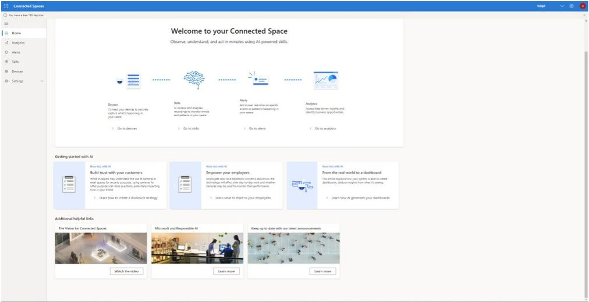

# Get started with the Dynamics 365 Connected Spaces Preview web app

The Microsoft Dynamics 365 Connected Spaces Preview web app [works together with the Azure Stack Edge gateway, networked cameras, and the Azure Cloud Service](how-cs-works.md) to provide insights about your connected store or space. You can use the web app to complete the following tasks:

- [Connect cameras to your Azure Stack Edge gateway](web-app-cameras-connect.md).

- [Add skills to collect data](web-app-cameras-add-skills.md).

- [Get insights about your store](web-app-get-insights.md).

- [Set store operating hours or access other store settings](web-app-space-details.md).

The **Home** page in the web app provides links for all these tasks, so that you can easily get started.

The **Home** page also provides links to videos and other helpful information to help you build trust with your customers and employees.

## See also

- [How Dynamics 365 Connected Spaces Preview works](how-cs-works.md)
