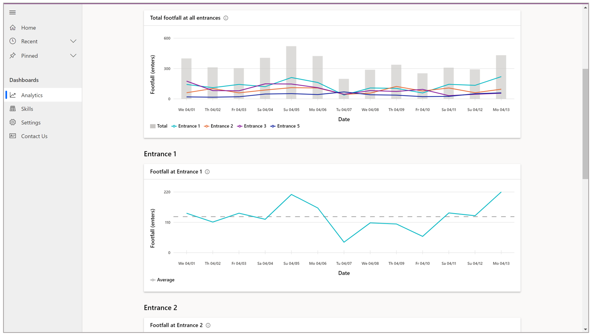
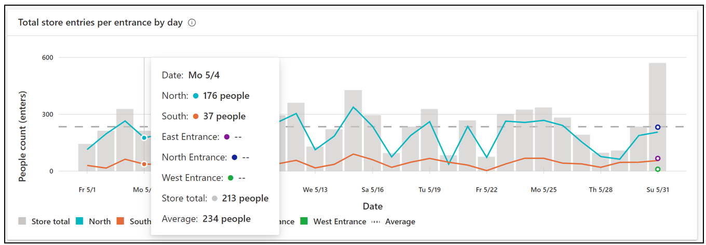

# View the summary pages on the Analytics page in Dynamics 365 Connected Store

You can [use the **Analytics** page](web-app-get-insights.md) in the Microsoft Dynamics 365 Connected Store web app to get insights on your retail store. This article describes how to view summary pages (available from the **Analytics** page for any skill).

## View a summary page for a particular skill

To view the summary page with additional visualizations for any skill, select the blue arrow to the right of the skill. 

To go back to the **Analytics** page from any summary page, select from the breadcrumb at the top of the page.

## Shopper analytics summary page

The **Shopper analytics summary** page includes insights related to footfall trends, patterns, changes, and anomalies at store 
entries/exits. This page shows a view of the performance of all Shopper analytics zones. You can explore how many people visited 
the store during a given timeframe, categorized by entrance.

The banner at the top of the page highlights the key takeaways and comparisons. The first two cards, **Store footfall** and **Busiest day**, are carried over from the [**Analytics** page](web-app-get-insights.md). 

**Least busy day**. This card highlights the day and date within the selected time frame that had the least number of people, 
along with the people count. 

The subscript in the card describes the absolute change in this value for the current time frame compared to average footfall across all 
displays during the selected time frame. The triangle to the left of the subscript indicates the difference in footfall for the 
highlighted day, compared to the daily average footfall during the selected time frame. 

**Busiest entrance.** This card highlights the name and corresponding value of the Shopper analytics zone that received the greatest 
footfall for the selected time frame. 

The subscript in the card describes the absolute change in this value for the current time frame compared to the previous time frame of equal duration. The triangle to the left of the subscript indicates whether this change was positive or negative. 

**Least busy entrance.** This card highlights the name and corresponding value of the Shopper analytics zone that received the least 
footfall for the selected time frame. 

The subscript in the card describes the absolute change in this value for the current time frame compared to the previous time frame of equal duration. The triangle to the left of the subscript indicates whether this change was positive or negative. 

**Total footfall at all entrances.** This graph shows total store footfall according to Shopper analytics zone. 

You can view trends for individual zones in the line graphs below (for example, **Footfall at Entrance 1**).

To see data for each individual entrance, hover over the desired data in the graph.

## Display effectiveness summary page

The **Display effectiveness summary** page shows a view of the performance of all display effectiveness zones and their performance 
relative to each other. Use this page to answer this question: “How effective are my displays?”

### Highlights banner

The banner at the top of the page highlights the key takeaways and comparisons. The **Store footfall**, **Busiest display**, and 
**Most engaging display** cards are carried over from the [**Analytics** page](web-app-get-insights.md). 

**Least busy display.** This card highlights the name of the display that had the least number of people for the selected time 
frame, along with the people count. 

> [!NOTE]
> Because there are several factors that can contribute to a change in value (for example, number of displays in the store or a change 
in display configuration), the app does not include a comparison subscript.

**Least engaging display.** This card highlights the name of the display where people engaged (dwelled) shorter on average than other 
displays, along with the time, in seconds, for dwell time. 

The subscript in the card describes the absolute change in this value for the current time frame compared to average engagement (dwell time) across all displays during the selected time frame. The downward triangle to the left of the subscript indicates that the change was negative. 

### Graphs and table

The **Display effectiveness summary** page also includes the **3 busiest displays** graph, **3 most engaging displays** graph, and **All store displays** table.

**3 busiest displays.** This graph shows the people count trend data for the three display effectiveness zones that, on average, 
received the greatest footfall during the selected time frame. These trend lines are placed in context with the average footfall 
across all display effectiveness zones, illustrated by the dotted line.

**3 most engaging displays.** This graph shows the dwell time trend data for the three display effectiveness zones in which people, 
on average, spent the most time during the selected time frame. These trend lines are placed in context with the average engagement 
(dwell) time across all display effectiveness zones, illustrated by the dotted line.

**All store displays.** This table contains a sortable list of all display effectiveness zones by name, total people count, and average 
engagement time. Sort the list by selecting a single column heading. You can also filter each metric for a specific value by using 
the **Filter** button next to each column heading.

To see data values for each display, hover over the graph. 

## Queue management summary page

The **Queue management summary** page shows a view of the performance of all queue management zones and their performance relative to each other. Use this page to answer this question: “How efficient are my queues?”

 

On this page, you can use the highlight cards, data visualizations, and summary table to:

- Identify the longest and shortest queue length

- Identify the slowest and fastest queue times with respect to the average queue time for all queues

- Visualize queue length and queue time trends for the longest and slowest queues

- Sort through a list of all store queues configured for insights according to queue name, longest and shortest queue values, and fastest and slowest queue times for the selected time range

## Highlights banner

The banner at the top of the page highlights the key takeaways and comparisons. The **Store footfall** and  **Longest queue** cards are carried over from the [**Analytics** page](web-app-get-insights.md).

**Shortest queue.** This card highlights the shortest queue length along with the name of the queue and the date on which the value was observed. 

	
> [!NOTE]
> Because there are several factors that can contribute to a change in value (for example, number of active queues in the store), the app does include a comparison subscript.

**Fastest queue.** This card highlights the shortest average wait time for people along with the name of the queue and the date on which the value was observed. 

 
The subscript in this card describes the absolute change in this value for the current time frame compared to average wait (dwell) time across all queues during the selected time frame. The triangle to the left of the subscript indicates whether the change was positive or negative.

## Graphs

There are two graphs at the bottom of the page: **3 longest queues** and **3 slowest queues**.

**3 longest queues.** This graph shows the people count trend data for the three Queue management zones that received the greatest footfall during the selected time frame.

**3 slowest queues.** This graph depicts the wait (dwell) time trend data for the three Queue management zones in which people, on average, spent the most time during the selected time frame. 

To see data values for each queue, hover over the graph. 

## What's next?

[View details pages for Display effectiveness and Queue management skills](web-app-details-pages.md)
