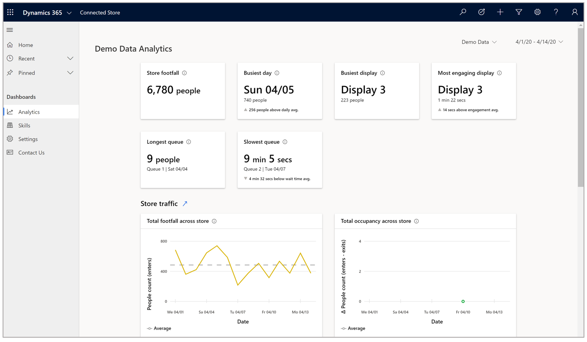
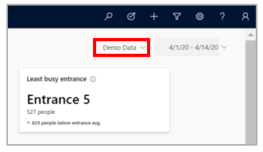
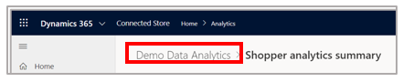

# Find your way around the Dynamics 365 Connected Store public preview web app

The Microsoft Dynamics 365 Connected Store public preview web app includes a left navigation pane that you can use to access the various pages in the app.

The following table describes each button in the left navigation pane.

|Item|Description|
|-----------------|-----------------------------------------------------------|
|Home|Go to the [**Analytics** page](web-app-get-insights.md).  **Important:** This is not the preferred method for going to the **Analytics** page. If you have more than one store that you're monitoring, the app will reset to the store that's at the top of the list in the **Store selector** menu.  Any changes made to the date picker will also reset the view to the default. The preferred method for getting to the **Analytics** page is to use the breadcrumb to preserve your view preferences. |
|Recent|Show the history of the pages you visited most recently.|
|Pinned|Pin items from the list of most recently visited pages to access them more quickly.|
|Analytics|This button functions the same way as the **Home** button.|
|Skills|You can configure measurements for a set of skill zones in your store. You can customize and manage these zones to populate data on the dashboards. Currently, measurement configuration is available [only in the mobile app](mobile-app-add-camera-skill-zones.md).|
|Settings|Change settings for stores, users, and devices.|
|Contact Us|Use this page if you have questions or just want to provide feedback to the Connected Store team! You can also find a link to the legal notices document on this page.| 

## What's next?

[Learn about the Analytics page](web-app-get-insights.md)
