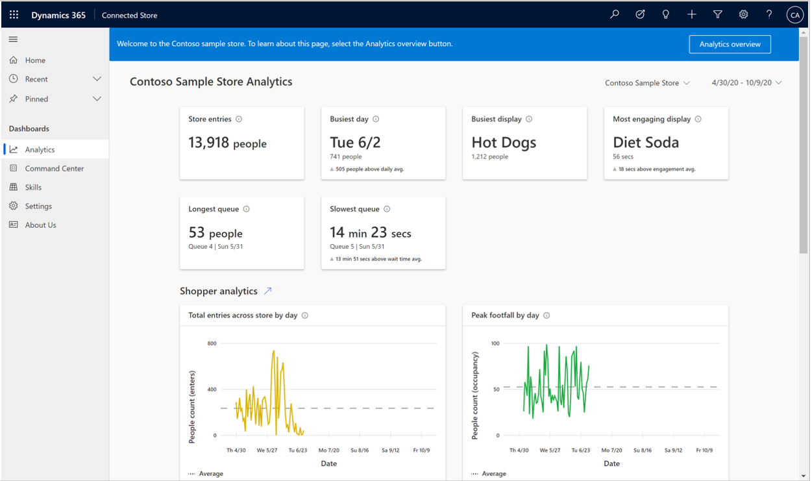

# Find your way around the Dynamics 365 Connected Store web app

The Microsoft Dynamics 365 Connected Store public preview web app includes a left navigation pane that you can use to access the various pages in the app.

The following table describes each button in the left navigation pane.

|Button|Item|Description|
|-----|-----------------|-----------------------------------------------------------|
||Home|Selecting this button takes you to the [**Analytics** page](web-app-get-insights.md).  **Important:** This is not the preferred method of going to the **Analytics** page. If you have more than one store you're monitoring, the app will reset to the store that is at the top of the list in the drop-down menu. Any changes made to the date picker will also be reset to the default. The preferred method of returning to the **Analytics** page is to use the breadcrumbs at the top of the page. Using the breadcrumbs preserves your view preferences.|
||Recent|This shows you the history of the pages you visited most recently.|
||Pinned|You can pin items from the list of most recently visited pages to access them more quickly.|
||Analytics|This button functions the same way as the **Home** button.|
||Skills|You can configure measurements for a set of skill zones in your store. You can customize and manage these zones to populate data on the dashboards. Currently, measurement configuration is available [only in the mobile app](mobile-app-add-skill-zones.md).|
||Settings||
||Contact us|Use this page if you have questions or just want to give us feedback! You can also find a link to the legal notices document on this page.| 

## What's next?

[Learn about the Analytics page](web-app-get-insights.md)
