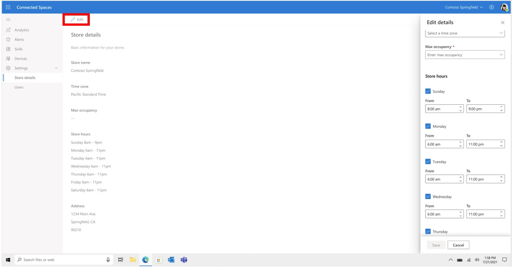

# Set your store's operating hours in Dynamics 365 Connected Spaces Preview

[!INCLUDE[banner](includes/banner.md)]

You can set your store's operating hours in Microsoft Dynamics 365 Connected Spaces Preview. If you don't set your operating hours, by default, Connected Spaces will set your store hours for every day of the week to 6:00 am – 8:00 pm in your store's time zone.

## Set operating hours

1. On the left side of the screen, select the arrow next to **Settings**, and then select **Store details**.

    

2. Select **Edit** at the top of the screen.

    
    
3. In the right side of the screen, under **Edit details**, scroll down to the **Store hours** section, and then:

    - Select the check box next to the day of the week to set or remove operating hours for that day.
    - In the **From** and **To** fields, enter opening and closing times for data collection. 

    

4. Select **Save**. 

