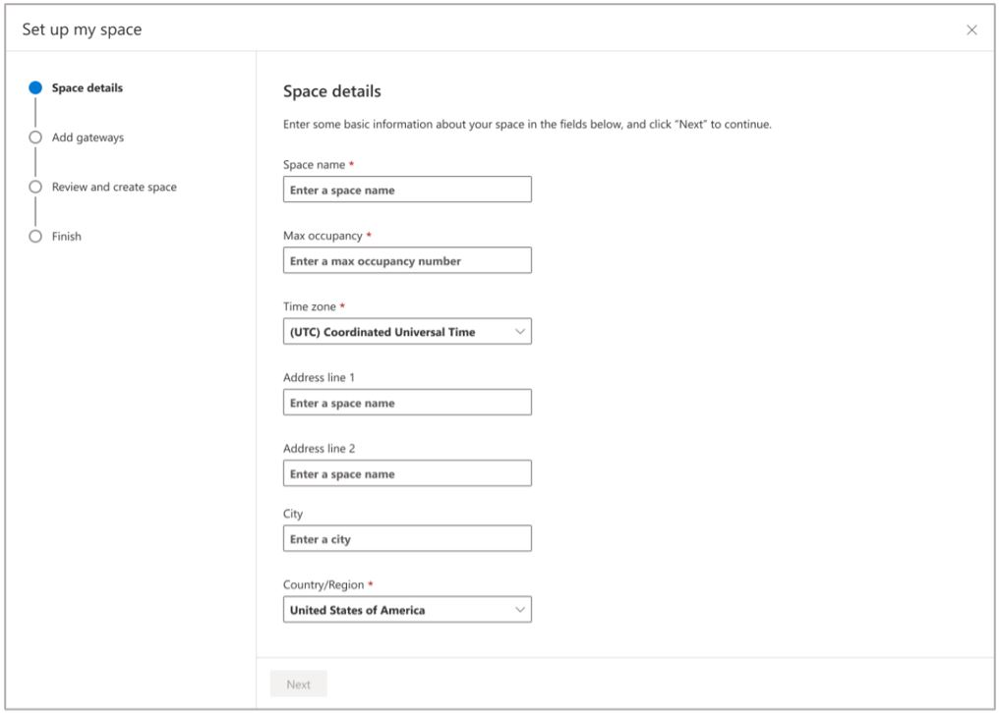
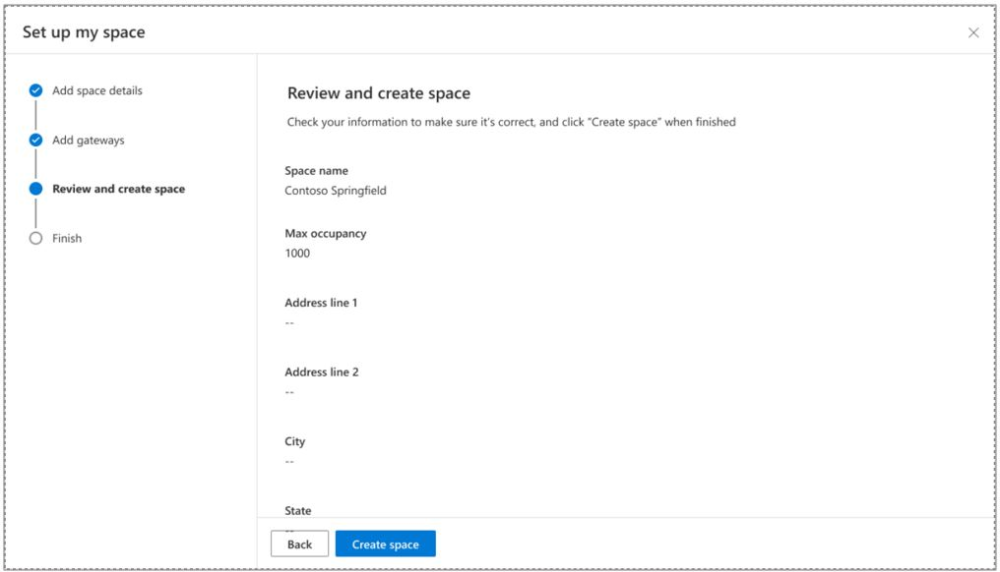

# Create a space in Dynamics 365 Connected Spaces Preview

After you [prepare your network and install Azure Stack Edge Pro (2 GPU)](ase-install.md), you’re ready to create a store in 
Microsoft Dynamics 365 Connected Spaces Preview. 

## Create a space

When you sign in to Connected Spaces with your admin credentials for the first time (and if you haven't already created a space), the **Set up my space** page automatically appears.

On the **Set up my space** page:

1. In the **Space name** field, enter a friendly name for your space.

2. In the **Max occupancy** field, set the maximum number of people allowed in the space at one time. 

3. In the **Time zone** field, set the time zone for your space.

4. Fill in the **Address** and **City** fields with the address for your space.

5. In the **Country/Region** field, select the appropriate country/region.

    > [!NOTE]
    > You must select a value in the **Country/Region** field to enable the **State** field.

6. In the **State** field, enter the state for your space. 

7. Select **Next**.

8. Make sure that all the store details are correct, and then select **Create space**.

      
    
9. Select **Done**. 

Now you're ready to connect cameras to your space. 
 
## Next steps

- [Connect cameras](web-app-cameras-connect.md)
- [Add camera skills](web-app-cameras-add-skills.md)
- [See details for your space](web-app-space-details.md)
