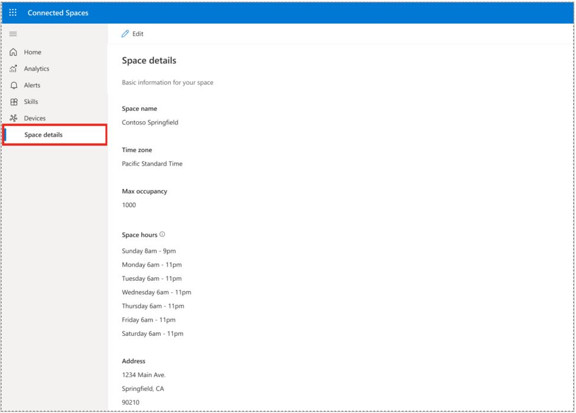

# Set options for your space in Dynamics 365 Connected Spaces Preview

You can set options for your space, such as operating hours, in Microsoft Dynamics 365 Connected Spaces Preview. If you don't set your operating hours, by default, Connected Spaces will set your operating hours for every day of the week to 6:00 am – 8:00 pm in the time zone for your space.

## Set operating hours

1. On the left side of the screen, select **Space details**.

    

2. Select **Edit** at the top of the screen, and then under **Edit details** on the right side of the screen, scroll down to the **Store hours** section.

    
    
3. In the **Store hours** section: 

    - Select the check box next to the day of the week to set or remove operating hours for that day.
    - In the **From** and **To** fields, enter opening and closing times for data collection. 

4. Select **Save**. 

