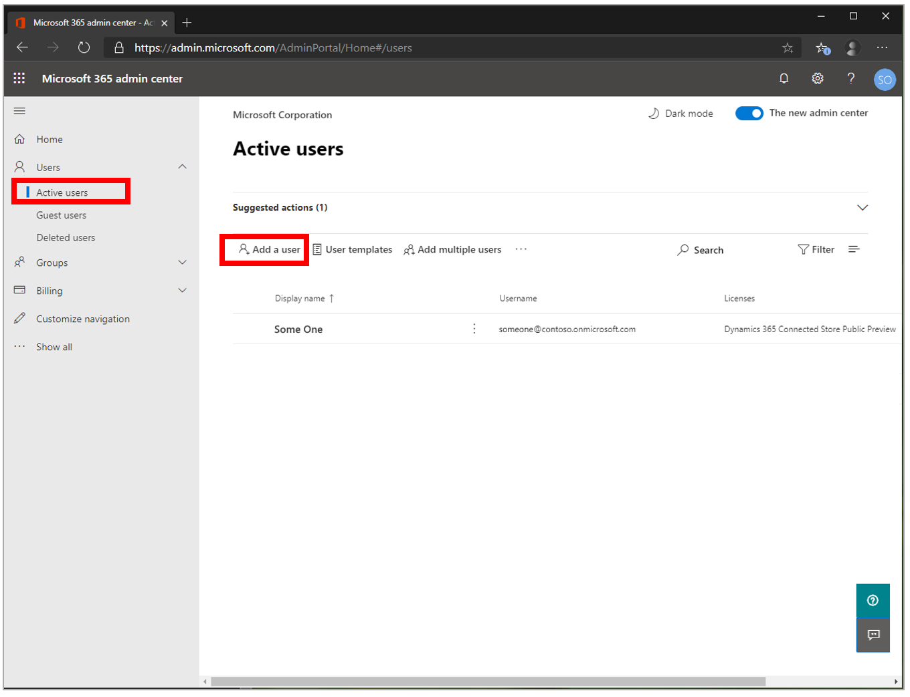
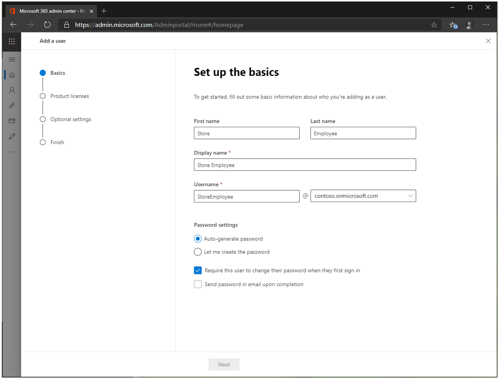
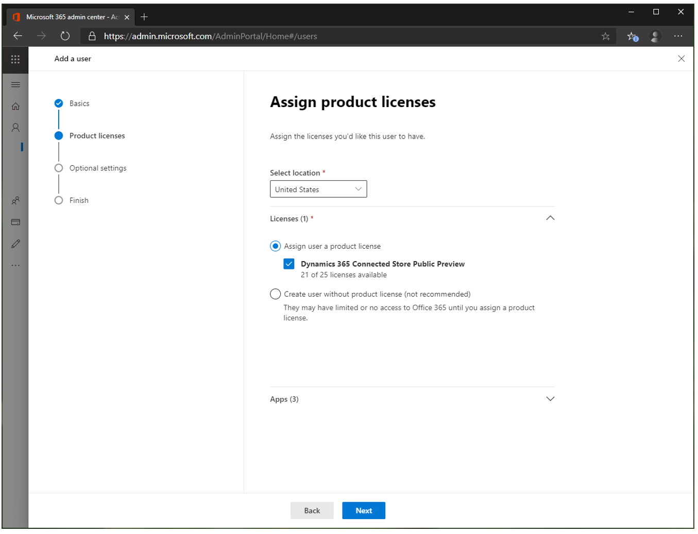
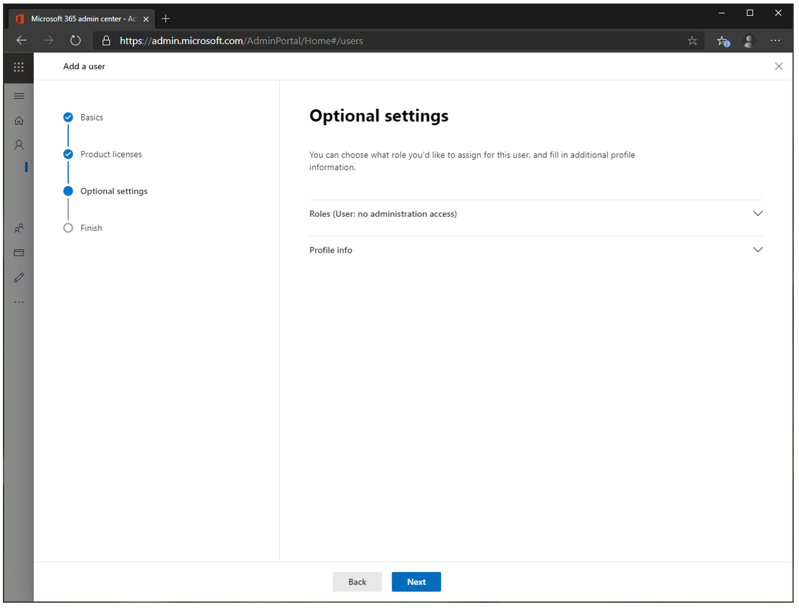
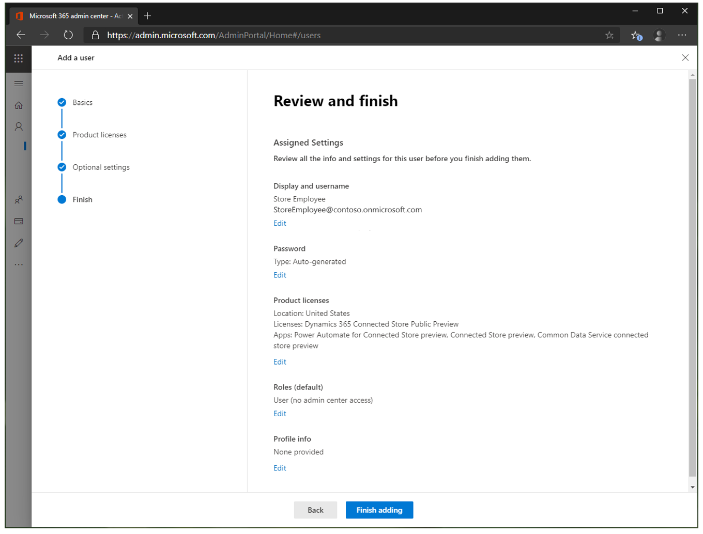
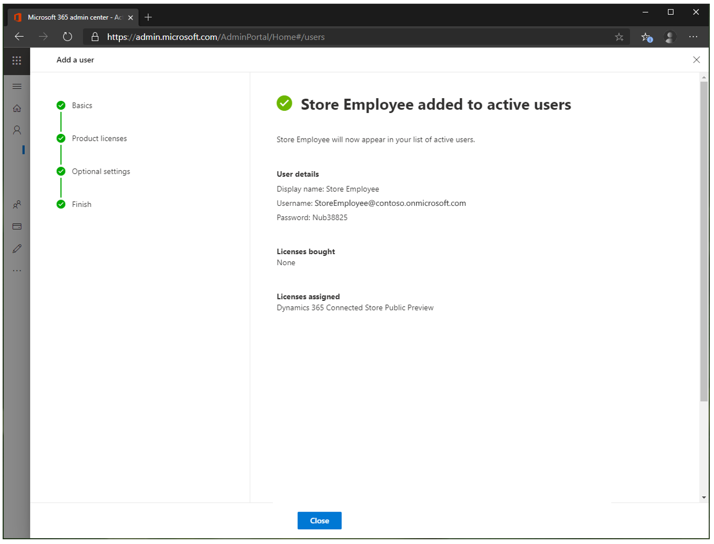

# Prepare user accounts for Dynamics 365 Connected Spaces Preview

[!INCLUDE[banner](includes/banner.md)]

To add additional users to Microsoft Dynamics 365 Connected Spaces Preview, you must first assign the Dynamics 365 Connected Spaces Preview license to a new or existing user in the Microsoft 365 admin center. Then you can configure the roles that the users will have access to (**Connected Store Admin** or **Connected Store Viewer**).

## Create new user accounts in the Microsoft 365 admin center

1. Open the [Microsoft 365 admin center](https://admin.microsoft.com/).

2. In the left pane, select **Users**, and then select **Active users**.

3. On the **Active users** page, select **Add a user**.

   
    
4. On the **Set up the basics** page, fill in the information for the new user. When you've finished, select **Next**.

    
    
    > [!NOTE]
    > By default, a password is automatically generated for new user accounts. Users must change this password the first time that they sign in by using their new account. 
    If you want to set a permanent password instead of using an automatically generated password, select the **Let me create the password** option and clear the **Require this 
    user to change their password when they first sign in** check box.
    
5. On the **Assign product licenses** page, select the location for the user, and then, under **Licenses**, select the **Dynamics 365 Connected Store Public Preview** check box. 
When you've finished, select **Next**.

    

6. Leave the **Optional settings** page as is, and select **Next**.

    
    
7. Review the information on the last page. To make changes, select the **Edit** button below the relevant sections. When you've finished, select **Finish adding**.

    
    
8. If you selected the **Auto-generate password** option in step 4, make a note of the password. The user will need this password to sign in.
    
    
    
9. Select **Close**.

