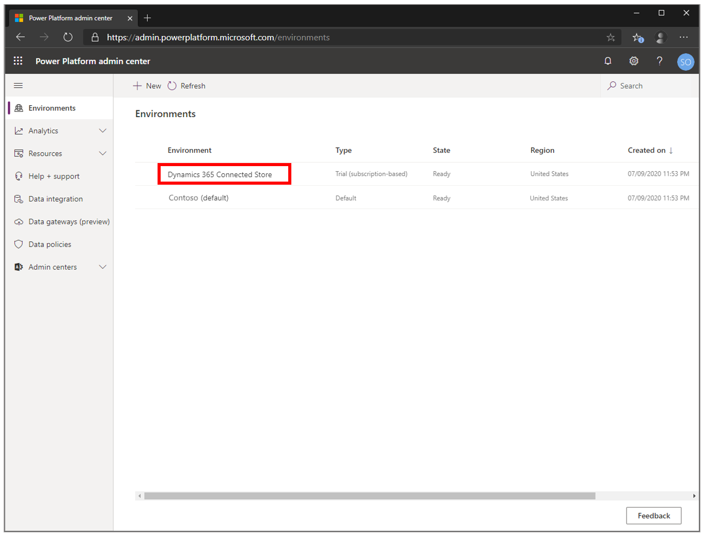
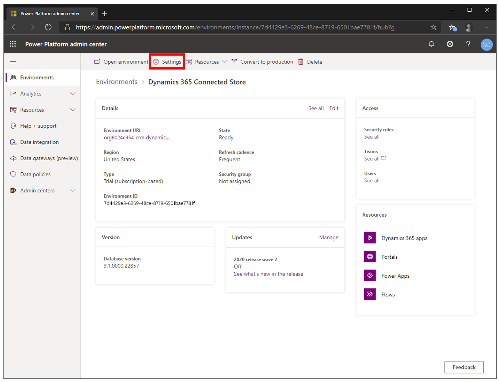
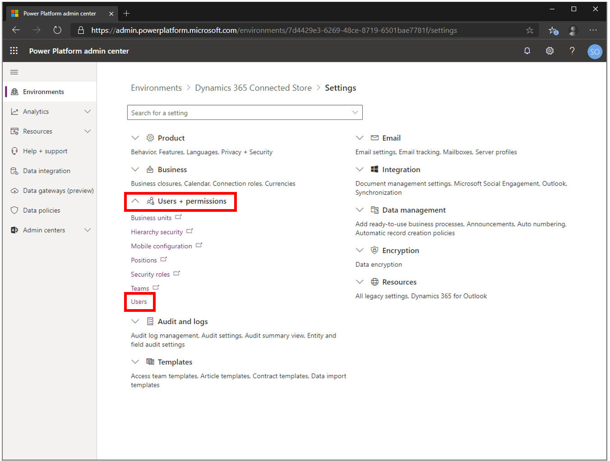
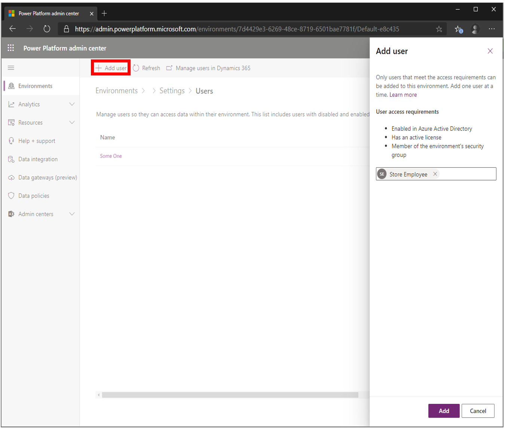
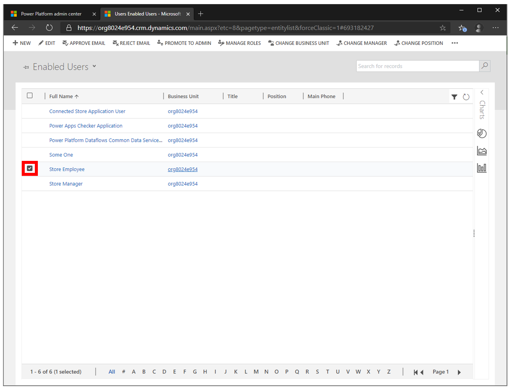

# Give users permissions to use Dynamics 365 Connected Spaces Preview

[!INCLUDE[banner](includes/banner.md)]

> [!NOTE]
> Effective November 2020:
>
> - Common Data Service has been renamed to Microsoft Dataverse. For more information, see [Power Automate Blog](https://aka.ms/PAuAppBlog).
> - Some terminology in Microsoft Dataverse has been updated. For example, *entity* is now *table* and *field* is now *column*. For more information, see [Terminology updates](/powerapps/maker/data-platform/data-platform-intro).
>
> This topic will be updated soon to reflect the latest terminology.

As an Azure Active Directory global admin, you can assign security roles to user accounts to enable users to do different tasks in Microsoft Dynamics 365 Connected Spaces Preview.

## Connected Spaces security roles

To give users permissions to use Connected Spaces, you must first assign either the **Connected Store Viewer** or **Connected Store Admin** role to any user accounts. 

> [!NOTE]
> The **Connected Store Admin** role is a superset of the **Connected Store Viewer** role.

The following table describes the privileges that each role grants.

|Role|	Description|
|--------------------------------|----------------------------------------------------------------------------------------------|
|**Connected Store Viewer**|	Use the Connected Spaces web app to:  - View the analytics dashboard, which provides insights on Shopper analytics, Display effectiveness, and Queue management camera skill zones - View the health status of gateway devices  - View store settings, such as operating hours, time zone, and address |
|**Connected Store Admin**|	Use the Connected Spaces mobile app to:  - Create stores and edit store information - Pair gateways and edit gateway information - Connect cameras to a gateway and edit camera information - Create and modify camera skill zones  Use the Connected Spaces web app to:  - View the analytics dashboard, which provides insights on Shopper analytics, Display effectiveness, and Queue management camera skill zones - View the health status of gateway devices - View and modify store settings, such as operating hours, time zone, and address|
|**Common Data Service User**|	Use the Connected Spaces web app.  [Learn more about this security role](/power-platform/admin/database-security#predefined-security-roles) |
|**Environment Maker**|	Use the Command Center to set up a maximum store occupancy notification by customizing a Power Automate flow.  [Learn more about this security role](/power-platform/admin/database-security#predefined-security-roles)|

## Assign a Connected Spaces security role to a user account

1. Open the [Power Platform admin center](https://admin.powerplatform.com/). 
        
2. Select the environment that Connected Spaces is installed in.

    
    
3. Select **Settings**.

    
    
4. Expand the **Users + permissions** heading, and then select **Users**.

    

5. Do one of the following:

   - If the users are already in the list, skip to step 6 to assign user roles.       
   
   - If you need to add one or more users, select **Add user**, enter the account details in the **Add user** pane on the right side of the screen, and then select **Add**. 

          
    
6. Select **Manage users in Dynamics 365**.

       

7. In the **Enabled Users** screen, select the check box next to the appropriate user account.    

          
   
8. Select **MANAGE ROLES**. 

    

9. Select the **Connected Store Admin** or **Connected Store Viewer** security role, and the **Common Data Service User** role. If this user also needs to be able to use the Command Center to send notifications about maximum store occupancy, select the **Environment Maker** role. Select **OK** when you're done.

    

[Learn more about creating users and assigning security roles](/power-platform/admin/create-users-assign-online-security-roles) for Dynamics 365 applications.

## Next step

[Start planning camera placement](camera-placement-checklist.md)
