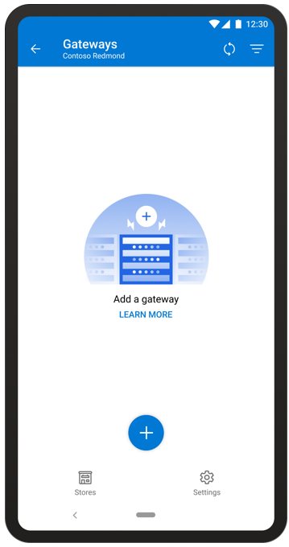
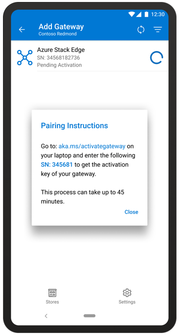
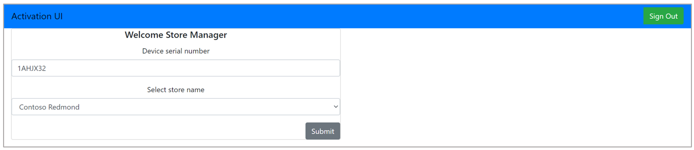
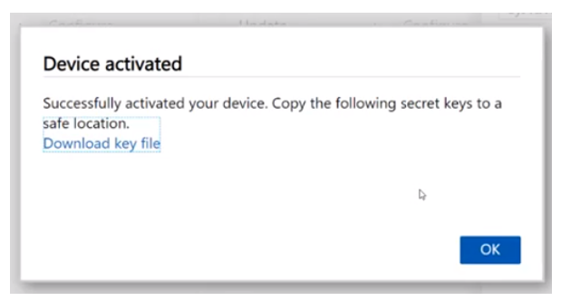
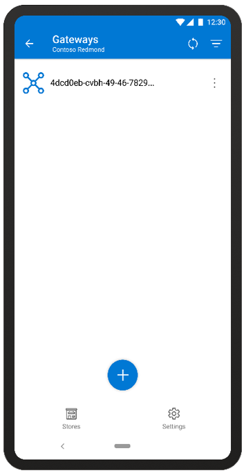
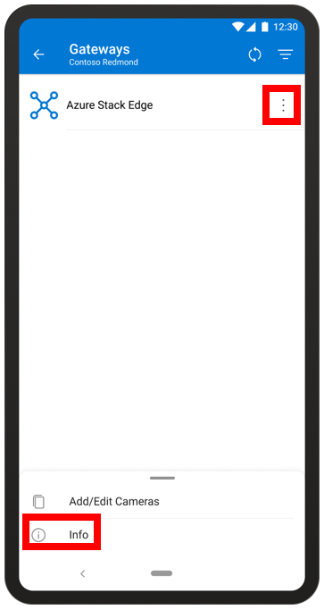

# Pair a gateway with the Dynamics 365 Connected Spaces Preview mobile app

[!INCLUDE[banner](includes/banner.md)]

Before you can pair a gateway with the Microsoft Dynamics 365 Connected Spaces Preview mobile app, you need to:

1. [Install Azure Stack Edge Pro (2 GPU)](ase-install.md)

2. [Connect Azure Stack Edge Pro to your network](ase-connect.md)

3. Create a store with the mobile app

## Pair a gateway

To complete this procedure, you'll use the mobile app and your laptop, which should be connected to Azure Stack Edge Pro as described in [Connect Azure Stack Edge Pro to your network](ase-connect.md).

1.	On the **Stores** page, tap a store in the Stores list. 

    
    
    This opens the **Gateways** page. 
 
2.	Tap the **+** sign at the bottom of the **Gateways** page.

    

3.	Select the gateway you want to pair with, and then tap the **Add** button next to it. You’ll see the **Add Gateway** screen and the following message: 

    “Go to aka.ms/activategateway on your laptop and enter the following serial number to get the activation key of your gateway.”

    
    
    > [!NOTE]
    > If you don't see the serial number in the mobile app, you can also find it in the Azure Stack Edge Pro user interface, or on the Azure Stack Edge Pro gateway itself. The pull-out tab on the front of the gateway (behind the faceplate) contains the serial number.

4.	Enter **aka.ms/activategateway** into your laptop web browser that’s connected to the gateway, and then select **Sign in**.

5.	Enter your Dynamics 365 Connected Spaces credentials.
     
6.	Enter the serial number from the mobile app.
 
    
 
7.	Select the store you created earlier in the mobile app, and then select **Submit**.

    > [!IMPORTANT]
    > Make sure to press the **Submit** button just once. When you press **Submit**, Connected Spaces starts the process to generate the activation key. It takes a few minutes to generate the key. 

    

    > [!IMPORTANT]
    > You must activate Azure Stack Edge Pro within 24 hours after the activation key is generated. 
 
8.	When the activation key is ready, copy the key (use **Copy to clipboard** to copy the full key), go to the Azure Stack Edge Pro **Get started** page, select **Activate**, paste the key into the **Activation key** field in the **Activate** pane, and then select **Activate**. 

    
 
    The activation process can take from one to ten minutes. 
    
    >[!TIP] 
    >You can select the **Bell** button in the upper-right corner of the **Azure Stack Edge Pro** page to monitor activation status. 
    
    When the device is activated, a notification will appear in the **Azure Stack Edge Pro** page to let you know that the activation is complete. 

    
 
    The Dynamics 365 Connected Spaces modules will begin downloading on the gateway. This can take up to 60 minutes. You'll know that the gateway is connected when it appears in the **Gateways** page in the mobile app. 
    
     
    
    After Azure Stack Edge Pro is connected, you can connect your cameras and add camera skill zones. 
    
> [!NOTE]
> The gateways paired to your store can’t be shared between the different stores of your organization. To pair an available gateway, contact your account admin.

## How do I change the IP range that the gateway uses to scan for cameras?

To modify the IP range used to get the list of available cameras:

1. On the **Gateways** page, tap the **Actions** button, and then tap **Info** at the bottom of the screen.

    

2. Update the IP range values. 

    
    
3. When you’re finished, select the check mark in the upper-right corner of the screen.
  
## Sort the Gateways list

If you have a lot of gateways in your Gateways list, you might want to sort the list to find the gateway you're looking for. 

To sort the Gateways list:

- Select the **Sort**  button at the top of the **Gateways** page.

