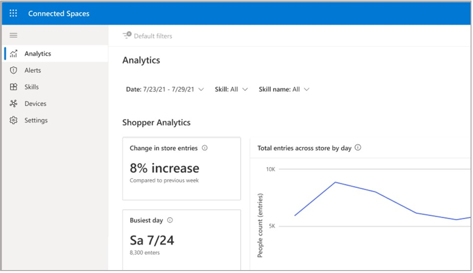

# Find your way around the Dynamics 365 Connected Spaces Preview web app

[!INCLUDE[banner](includes/banner.md)]

The Microsoft Dynamics 365 Connected Spaces Preview website includes a left navigation pane that you can use to access the pages in the app.

The following table describes each button in the left navigation pane.

|Item|Description|
|-----------------|-----------------------------------------------------------|
|**Analytics**|Analytics includes the dashboards and filters to view data collected from camera skills, by store.|
|**Alerts**|Coming soon!|
|**Skills**|You can configure measurements for a set of camera skills in your store. You can customize and manage these skills to populate data on the dashboards.|
|**Settings**|Change settings and details for your stores.|

## Next steps

Learn about these web app pages:

[Analytics page](web-app-get-insights.md) 
[Shopper analytics summary page](shopper-analytics-summary-page.md) 
[Display effectiveness summary page](display-effectiveness-summary-page.md) 
[Display effectiveness details page](display-effectiveness-details-page.md) 
[Queue management summary page](queue-management-summary-page.md) 
[Queue management details page](queue-management-details-page.md)
